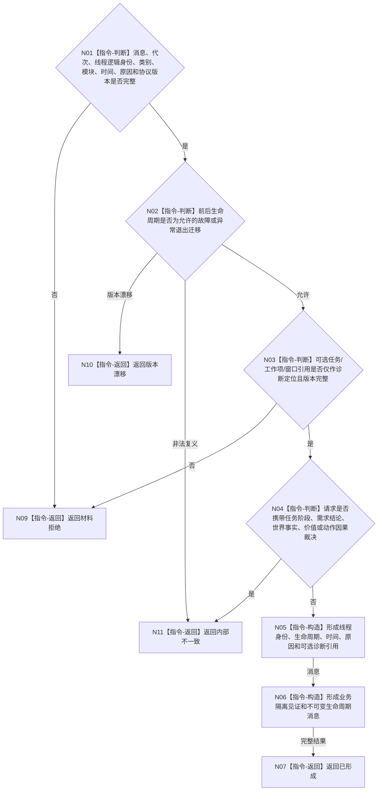

# BIZ-L3-004-15-01 构造线程生命周期故障消息目标函数流程图 v0.1

更新时间：2026-08-03

## 依据

```text
4050、8100、8110；BIZ-L2-004-15、BIZ-L2-005-02
```

## 身份与边界

正式目标函数设计图。把任一线程的结构化故障输入转换为 8110 生命周期消息，严格隔离纯线程投影与任务业务结论；不发布消息。

## 函数合同

```text
根函数：构造线程生命周期故障消息
归属模块 / 文件 / 层级：线程生命周期协议 / 海中鱼巣/线程/协议.线程生命周期.ixx / L3
现有或待新增：待新增通用纯值函数；任务工作与控制面板线程共用
完整签名：线程生命周期故障消息形成结果 构造线程生命周期故障消息(const 线程生命周期故障消息形成请求& 请求) noexcept
参数：请求为只读借用；含消息身份、运行代次、线程逻辑身份、可选系统线程ID、线程类别、所属模块、前后生命周期、发生时间、原因键、可选诊断引用和协议版本
返回结果：值式结果；含已形成、材料拒绝、版本漂移或内部不一致，以及不可变线程生命周期消息和业务隔离见证
被调函数流程图：无；字段、状态迁移和禁止载荷复核均为本函数内纯值指令
父图：BIZ-L2-004-15；BIZ-L2-005-02复用
```

## 流程图



## 节点合同

| 节点 | 类型 | 参数 / 输入绑定 | 结果 / 输出绑定 | 事实读写 | 后继条件 | 验证 |
| --- | --- | --- | --- | --- | --- | --- |
| N01/N02 | 指令 | 线程故障输入 | 生命周期资格 | 无写入 | 允许、拒绝、漂移或错误 | 逻辑身份和系统ID分离；迁移矩阵 |
| N03/N04 | 指令 | 诊断引用和载荷 | 业务隔离资格 | 无写入 | 仅诊断材料 | 不含任务、需求、世界或价值结论 |
| N05—N07 | 指令 | 合法输入 | 不可变生命周期消息 | 无写入 | 完成 | 原因强类型化，文本只作说明 |

## 关键边界

线程堵塞、故障和退出不能映射为任务等待、失败或完成。可选业务对象引用只帮助定位运行载体，不提供业务结论。

