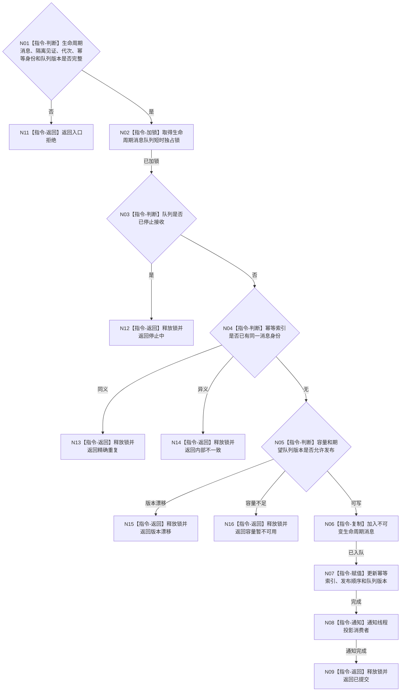

# BIZ-L3-004-15-02 提交线程生命周期消息目标函数流程图 v0.1

更新时间：2026-08-03

## 依据

```text
4050、8110；BIZ-L2-004-15、BIZ-L2-005-02
```

## 身份与边界

正式目标函数设计图。把一条完整不可变生命周期消息发布到线程信息缓存输入队列；锁内只判重、容量、入队和通知，不阻塞业务领域提交。

## 函数合同

```text
根函数：线程生命周期消息队列::提交线程生命周期消息
归属模块 / 文件 / 层级：线程生命周期消息队列 / 海中鱼巣/线程/线程生命周期消息队列.ixx / L3
现有或待新增：待新增；作为8110各线程共用发布基座
完整签名：线程生命周期消息提交结果 线程生命周期消息队列::提交线程生命周期消息(const 线程生命周期消息提交请求& 请求)
参数：请求为只读借用；含不可变生命周期消息、业务隔离见证、运行代次、消息幂等身份和期望队列版本
返回结果：调用方拥有的值式结果；含已提交、精确重复、容量暂不可用、停止中、版本漂移或内部不一致，以及消息身份、发布顺序、队列版本和重试边界
被调函数流程图：无；锁内队列操作均为本函数内指令
父图：BIZ-L2-004-15；BIZ-L2-005-02复用
```

## 流程图



## 节点合同

| 节点 | 类型 | 参数 / 输入绑定 | 结果 / 输出绑定 | 事实读写 | 后继条件 | 验证 |
| --- | --- | --- | --- | --- | --- | --- |
| N02—N05 | 指令 | 请求和队列状态 | 发布资格 | 只读/锁内队列元数据 | 可写或非成功 | 停止、幂等、版本、容量 |
| N06—N08 | 指令 | 不可变消息 | 队列项和通知 | 只写线程信息链 | 已发布 | 不调用控制面板或业务服务 |
| N09/N11—N16 | 返回 | 发布结果 | 结构化状态 | 无业务写入 | 终止 | 满载允许同消息重试 |

## 关键边界

控制面板不存在或消息队列暂不可用不能撤销业务事实，也不能让业务线程长期阻塞。发布成功只证明线程投影输入到达，不证明页面已显示。
