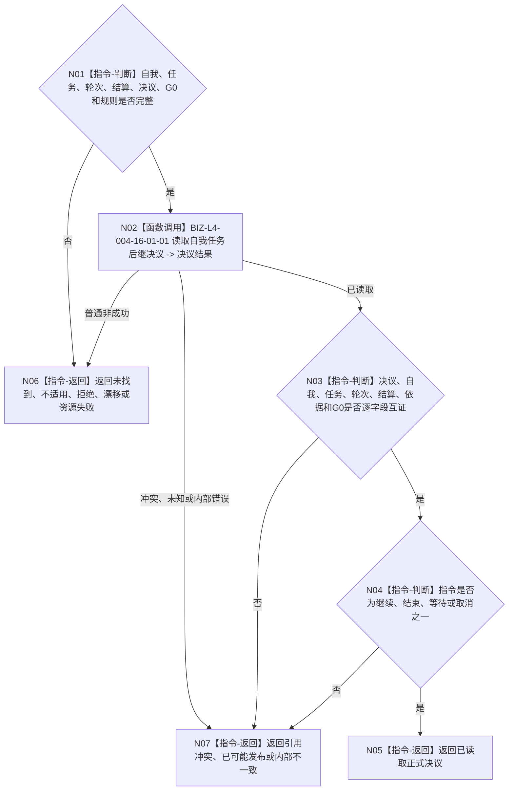

# BIZ-L3-004-16-01 独立读取并互证自我任务后继决议目标函数流程图 v0.1

更新时间：2026-08-26

## 依据

```text
0050、5090 v0.8、8100 v0.8、8200
BIZ-L2-004-16 v0.2；BIZ-L3-004-08-05 v0.2
```

## 身份与边界

正式目标函数设计图。按显式自我、任务、已收束任务轮次、轮次结算、后继决议身份和 `G0` 独立读取正式 self 后继决议，并逐字段互证指令、依据、截止和适用任务。它不推导决议，不写 task owner。

## 函数合同

```text
根函数：任务主阶段治理提供者::独立读取并互证自我任务后继决议
归属模块 / 文件 / 目标分解深度：任务主阶段治理 / 海中鱼巣/领域/内部治理/服务.任务主阶段治理.ixx / BIZ-L3
现有或待新增：现有 `读取自我任务后继决议` 相邻链可适配
完整签名：任务后继决议读取结果 任务主阶段治理提供者::独立读取并互证自我任务后继决议(const 任务后继决议读取请求& 请求) const noexcept
参数：自我、任务、已收束任务轮次、轮次结算、决议、G0和规则版本
返回结果：已读取、未找到、不适用、入口/许可拒绝、当前性漂移、引用冲突、资源失败、已可能发布或内部不一致；成功携带唯一正式决议
被调函数流程图：BIZ-L4-004-16-01-01
父图：BIZ-L2-004-16
```

## 流程图



## 关键边界

目标未达成、队列顺序、线程当前值和历史请求都不能生成或替代正式 self 后继决议。
