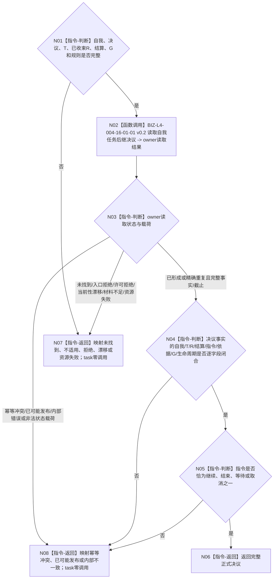

# BIZ-L3-004-16-01 独立读取并互证自我任务后继决议目标函数流程图 v0.2

更新时间：2026-08-27

## 依据

```text
0050、3200 v0.9、5090 v0.8、8100 v0.8、8200
SELF-GOVERNANCE-CLOSURE-L4-INTEGRATED 详细设计 v0.1第6.7节、v0.3第5.2节
BIZ-L2-004-16 v0.2
```

## 身份与边界

正式目标函数设计图。该 module-private 组合只按显式自我、决议身份、任务、已收束任务轮次和非零来源共同事实截止调用 self owner 公开读取入口，再逐字段互证轮次结算、指令、依据、生命周期与截止。它不按任务枚举决议，不形成决议，也不写 task owner。

## 函数合同

```text
根函数：任务主阶段治理提供者::独立读取并互证自我任务后继决议
完整签名：任务后继决议读取结果 任务主阶段治理提供者::独立读取并互证自我任务后继决议(const 任务后继决议读取请求& 请求) const noexcept
归属模块 / 文件 / 目标分解深度：海中鱼巣.领域.内部治理.服务.任务主阶段治理 / 海中鱼巣/领域/内部治理/服务.任务主阶段治理.ixx / BIZ-L3
实现状态：目标module-private组合；HEAD未实现
参数：自我、决议身份、任务、已收束任务轮次、轮次结算、来源共同事实截止和规则版本
返回结果：完整正式决议；或映射为决议未找到、决议不适用、入口/许可拒绝、当前性漂移、幂等冲突、资源失败、已可能发布或内部不一致
被调函数流程图：BIZ-L4-004-16-01-01 v0.2
父图：BIZ-L2-004-16 v0.2
```

## 流程图



## 关键边界

- self owner读取成功使用已冻结的`已形成/精确重复 + 完整事实 + 非零截止`谓词；本组合不得发明第二套`已读取`状态。
- 决议事实与显式T/R/结算/G不一致是引用或内部不一致，不得按消息、线程当前任务或历史最近项补齐。
- 任一读取非成功都发生在task owner调用之前。
