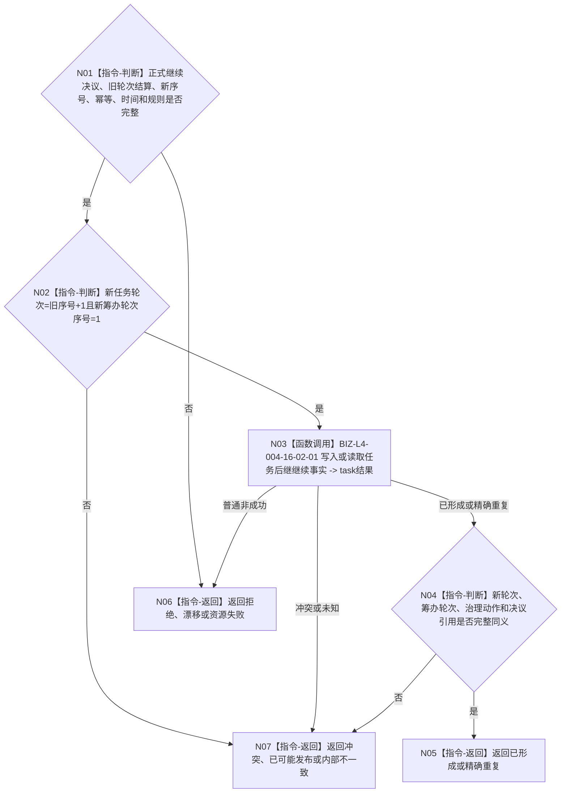

# BIZ-L3-004-16-02 继续分支建立新任务轮次事实目标函数流程图 v0.1

更新时间：2026-08-26

## 依据

```text
0050、4260 v0.11、5090 v0.8、8100 v0.8
BIZ-L2-004-16、BIZ-L3-004-16-01
```

## 身份与边界

正式目标函数设计图。仅当正式指令为 `继续当前任务` 时，由 task owner 原子建立下一任务轮次、该轮首个筹办轮次、继续治理动作和后继决议引用，并独立读回。旧路径、实例、冻结和授权不进入新轮次。

## 函数合同

```text
根函数：任务主阶段治理提供者::继续分支建立新任务轮次事实
归属模块 / 文件 / 目标分解深度：任务主阶段治理 / 海中鱼巣/领域/内部治理/服务.任务主阶段治理.ixx / BIZ-L3
现有或待新增：现有 task继续写入链可适配
完整签名：任务后继继续结果 任务主阶段治理提供者::继续分支建立新任务轮次事实(const 任务后继继续请求& 请求) noexcept
参数：正式继续决议、已收束轮次/结算、新轮次序号、新筹办轮次序号、task幂等、时间和规则
返回结果：已形成、精确重复、入口/许可拒绝、当前性漂移、引用/幂等冲突、资源失败、已可能发布或内部不一致
被调函数流程图：BIZ-L4-004-16-02-01
父图：BIZ-L2-004-16
```

## 流程图



## 关键边界

只有继续分支调用本函数；等待、结束、取消都不得建立新轮次或筹办轮次。
