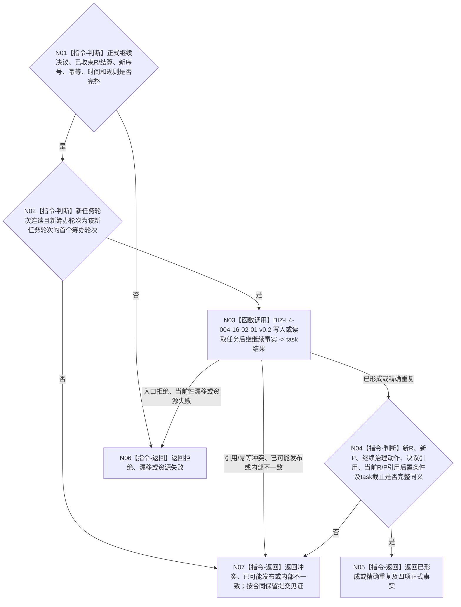

# BIZ-L3-004-16-02 继续分支建立新任务轮次事实目标函数流程图 v0.2

更新时间：2026-08-27

## 依据

```text
0050、3200 v0.9、4260 v0.11、5090 v0.8、5210
SELF-GOVERNANCE-CLOSURE-L4-INTEGRATED 详细设计 v0.3第5.2节
BIZ-L2-004-16 v0.2、BIZ-L3-004-16-01 v0.2
```

## 身份与边界

正式目标函数设计图。仅在已经独立读回的正式指令为`继续当前任务`时，本组合把完整 self 决议事实交给 task owner 机械入口，以一个 task 写集建立新的任务轮次、该轮首个筹办轮次、继续治理动作和决议引用，同时切换`T→当前任务轮次`并建立新轮次的当前筹办轮次引用，再独立读回四项返回事实和两个当前引用后置条件。它不调用阶段端口，也不选择后继指令。

## 函数合同

```text
根函数：任务主阶段治理提供者::继续分支建立新任务轮次事实
完整签名：任务后继继续结果 任务主阶段治理提供者::继续分支建立新任务轮次事实(const 任务后继继续请求& 请求) noexcept
归属模块 / 文件 / 目标分解深度：海中鱼巣.领域.内部治理.服务.任务主阶段治理 / 海中鱼巣/领域/内部治理/服务.任务主阶段治理.ixx / BIZ-L3
实现状态：目标module-private组合；HEAD未实现
参数：task请求头/幂等身份、完整继续决议事实、T、已收束R、轮次结算、新任务轮次序号、新筹办轮次序号、发生时间和规则版本
返回结果：已形成、精确重复、入口拒绝、当前性漂移、引用/幂等冲突、资源失败、已可能发布或内部不一致；成功携带四项完整事实与task正式读回截止，并保证当前R/P引用后置条件成立
被调函数流程图：BIZ-L4-004-16-02-01 v0.2
父图：BIZ-L2-004-16 v0.2
```

## 流程图



## 关键边界

- task owner一次写集建立四项返回事实并同次切换当前R/P引用；不存在按事实拆开的业务公开入口或跨owner原子提交。
- 新轮次建立成功不等于阶段已迁移；只有父图后续阶段读回闭合，整体继续才成功。
- 精确重复复用首次四项返回事实、当前引用后置条件和首次task读回，不产生第二轮次、第二筹办轮次或第二治理动作。
