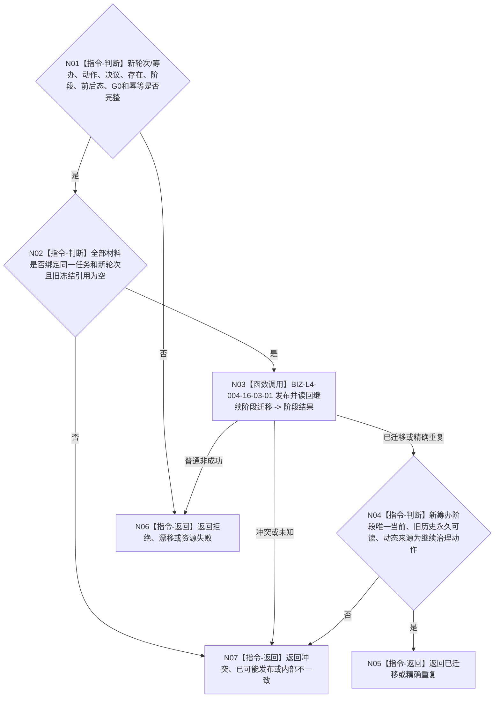

# BIZ-L3-004-16-03 继续分支迁移新轮次到筹办阶段目标函数流程图 v0.1

更新时间：2026-08-26

## 依据

```text
0050、1160、4260 v0.11、5090 v0.8、8100 v0.8
BIZ-L2-004-16、BIZ-L3-004-16-02
```

## 身份与边界

正式目标函数设计图。task owner新轮次事实正式读回后，以同一决议引用和继续治理动作把正式任务存在上的阶段迁移到新轮次筹办阶段，并独立读回新当前选择和永久历史。不得复用旧轮次阶段选择。

## 函数合同

```text
根函数：任务主阶段治理提供者::继续分支迁移新轮次到筹办阶段
归属模块 / 文件 / 目标分解深度：任务主阶段治理 / 海中鱼巣/领域/内部治理/服务.任务主阶段治理.ixx / BIZ-L3
现有或待新增：现有 `阶段端口_.发布阶段迁移` 相邻链可适配
完整签名：任务阶段迁移结果 任务主阶段治理提供者::继续分支迁移新轮次到筹办阶段(const 继续阶段迁移请求& 请求) noexcept
参数：新任务轮次事实、新筹办轮次、继续治理动作、决议引用、正式任务存在/阶段实例、前后态、阶段幂等、G0和时间
返回结果：已迁移、精确重复、入口/许可拒绝、当前性漂移、引用/幂等冲突、资源失败、已可能发布或内部不一致
被调函数流程图：BIZ-L4-004-16-03-01
父图：BIZ-L2-004-16
```

## 流程图



## 关键边界

新轮次从筹办开始；旧路径、实例方法、执行冻结、技术许可和自我现实执行授权均不可跨轮复用。
