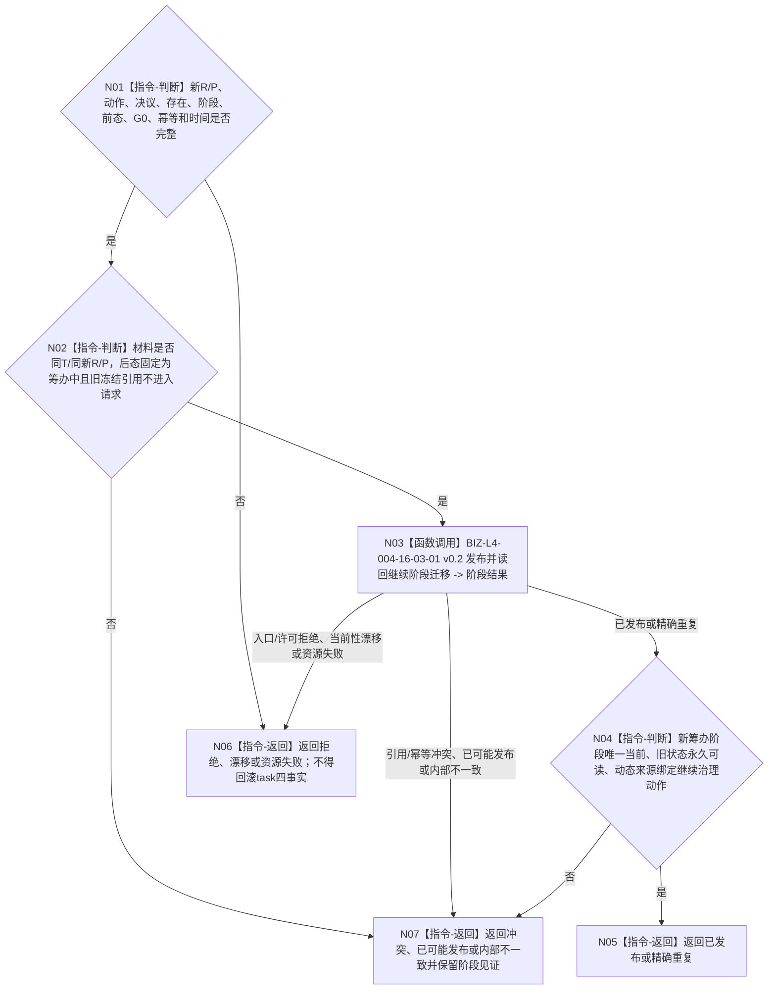

# BIZ-L3-004-16-03 继续分支迁移新轮次到筹办阶段目标函数流程图 v0.2

更新时间：2026-08-27

## 依据

```text
0050、1160、3200 v0.9、4260 v0.11、5090 v0.8、5210
SELF-GOVERNANCE-CLOSURE-L4-INTEGRATED 详细设计 v0.3第5.1—5.2节
BIZ-L2-004-16 v0.2、BIZ-L3-004-16-02 v0.2
```

## 身份与边界

正式目标函数设计图。task owner四项事实正式读回后，本组合只把已冻结的`继续阶段迁移`请求交给任务阶段结构消费端口。目标阶段固定为`{筹办,筹办中}`；旧当前选择和旧状态必须来自正式当前阶段读回。阶段事实由ARCH-L2 owner发布，task owner不得复制第二状态或动态权威。

## 函数合同

```text
根函数：任务主阶段治理提供者::继续分支迁移新轮次到筹办阶段
完整签名：任务阶段迁移结果 任务主阶段治理提供者::继续分支迁移新轮次到筹办阶段(const 继续阶段迁移请求& 请求) noexcept
归属模块 / 文件 / 目标分解深度：海中鱼巣.领域.内部治理.服务.任务主阶段治理 / 海中鱼巣/领域/内部治理/服务.任务主阶段治理.ixx / BIZ-L3
实现状态：目标module-private组合；HEAD未实现
参数：已读回新R/P/继续治理动作/决议引用、正式任务存在与阶段实例、正式前态、固定筹办后态、阶段幂等身份、G0和发生时间
返回结果：阶段端口的已发布、精确重复、入口/许可拒绝、当前性漂移、引用/幂等冲突、资源失败、已可能发布或内部不一致
被调函数流程图：BIZ-L4-004-16-03-01 v0.2
父图：BIZ-L2-004-16 v0.2
```

## 流程图



## 关键边界

- task提交与阶段提交各有独立代次和读回截止；不得要求二者相等。
- 阶段失败不回滚已经建立的新R/P、继续治理动作和决议引用；重试必须使用原双幂等身份收敛。
- 旧路径、实例、冻结、技术许可和现实执行授权均不得跨任务轮次复用。
