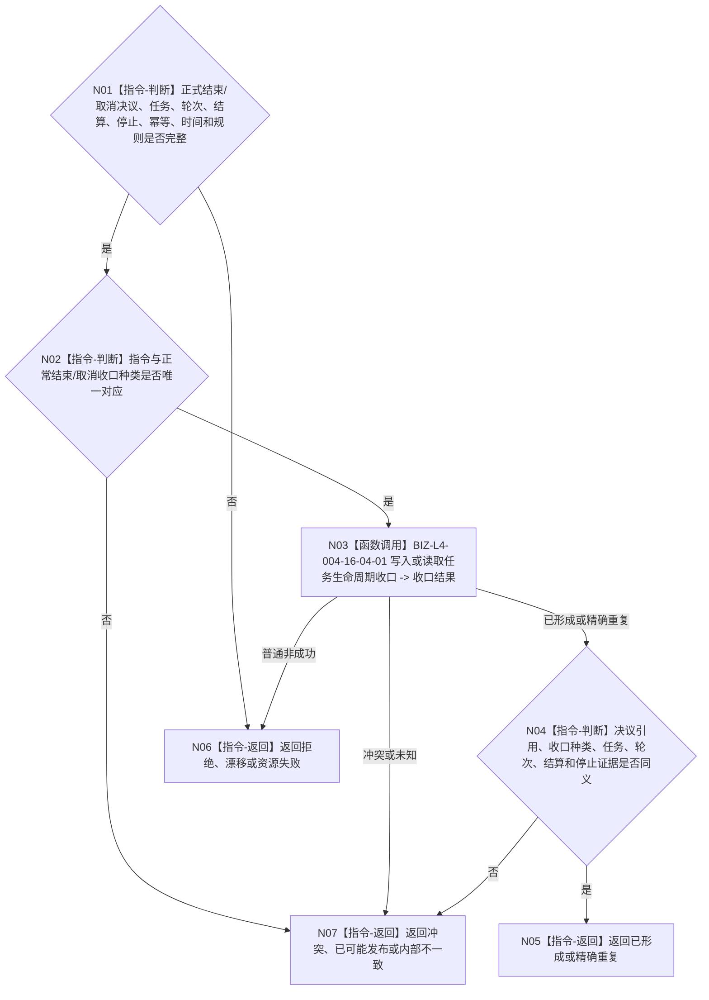

# BIZ-L3-004-16-04 结束或取消分支收口任务生命周期目标函数流程图 v0.1

更新时间：2026-08-26

## 依据

```text
0050、4260 v0.11、5090 v0.8、8100 v0.8
BIZ-L2-004-16、BIZ-L3-004-16-01
```

## 身份与边界

正式目标函数设计图。仅在正式指令为结束或取消时，由 task owner发布或精确重放对应生命周期收口和决议引用，再独立读回。等待分支不调用本函数并保持零写；结束/取消不建立新轮次。

## 函数合同

```text
根函数：任务主阶段治理提供者::结束或取消分支收口任务生命周期
归属模块 / 文件 / 目标分解深度：任务主阶段治理 / 海中鱼巣/领域/内部治理/服务.任务主阶段治理.ixx / BIZ-L3
现有或待新增：现有生命周期收口链可适配
完整签名：任务生命周期收口结果 任务主阶段治理提供者::结束或取消分支收口任务生命周期(const 任务生命周期收口请求& 请求) noexcept
参数：正式结束/取消决议、任务、已收束轮次、轮次结算、可选停止证据、幂等、时间和规则
返回结果：已形成、精确重复、入口/许可拒绝、当前性漂移、引用/幂等冲突、资源失败、已可能发布或内部不一致
被调函数流程图：BIZ-L4-004-16-04-01
父图：BIZ-L2-004-16
```

## 流程图



## 关键边界

等待是唯一零写成功分支；未找到、材料不足、漂移或资源失败都不能冒充等待。
