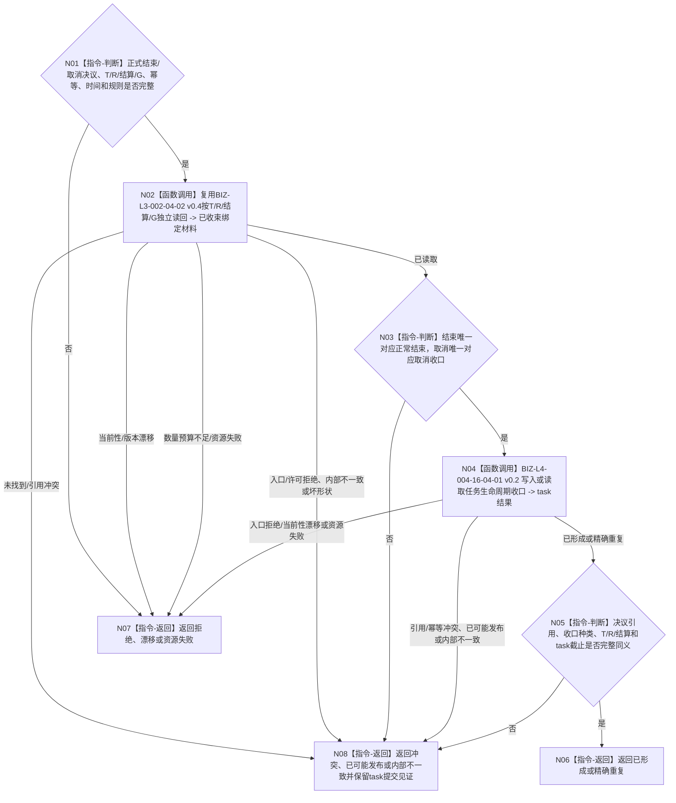

# BIZ-L3-004-16-04 结束或取消分支收口任务生命周期目标函数流程图 v0.2

更新时间：2026-08-27

## 依据

```text
0050、3200 v0.9、4260 v0.11、5090 v0.8、5210、8100 v0.8
SELF-GOVERNANCE-CLOSURE-L4-INTEGRATED 详细设计 v0.3第5.2节
BIZ-L2-004-16 v0.2、BIZ-L3-004-16-01 v0.2
```

## 身份与边界

正式目标函数设计图。仅当独立读回的正式指令为`结束当前任务`或`取消任务`时，本组合先复用BIZ-L3-002-04-02 v0.4按显式T/R/轮次结算/G独立复核轮次结算和`轮次已收束`阶段，再调用task owner机械入口以一个写集建立决议引用和对应生命周期收口。`保持等待`不调用本函数，结束/取消都不建立新轮次或阶段迁移。执行中的紧急取消不属于本组合。

## 函数合同

```text
根函数：任务主阶段治理提供者::结束或取消分支收口任务生命周期
完整签名：任务生命周期收口结果 任务主阶段治理提供者::结束或取消分支收口任务生命周期(const 任务生命周期收口请求& 请求) noexcept
归属模块 / 文件 / 目标分解深度：海中鱼巣.领域.内部治理.服务.任务主阶段治理 / 海中鱼巣/领域/内部治理/服务.任务主阶段治理.ixx / BIZ-L3
实现状态：目标module-private组合；发布源码未实现
参数：task请求头/幂等身份、完整结束或取消决议、T、已收束R、轮次结算、来源共同事实截止、唯一对应收口种类、发生时间和规则版本
返回结果：已形成、精确重复、入口拒绝、当前性漂移、引用/幂等冲突、资源失败、已可能发布或内部不一致；成功携带决议引用、生命周期收口和task正式读回截止
被调函数流程图：复用BIZ-L3-002-04-02 v0.4；BIZ-L4-004-16-04-01 v0.2
父图：BIZ-L2-004-16 v0.2
```

## 流程图



## 关键边界

- `轮次已收束`已经以正式收束前置证明运行停止；本组合不得要求调用方再提交或复制第二份停止证据。
- 若任务仍在动作执行，取消必须走3200第19.2节的紧急取消合同并携带动作停止、安全停止或无法停止证据，不能伪装成本组合的普通取消。
- 被复用旧结果类型若保留`许可拒绝`数值，只供历史解码；该值若异常出现，父新合同映射为`内部不一致`，不得向外产生许可拒绝。
- 等待是父函数内的零写成功分支，不调用生命周期收口入口。
- 生命周期收口不发布需求满足、价值结算、任务结果分配或新任务轮次，永久任务/轮次历史继续可读。
