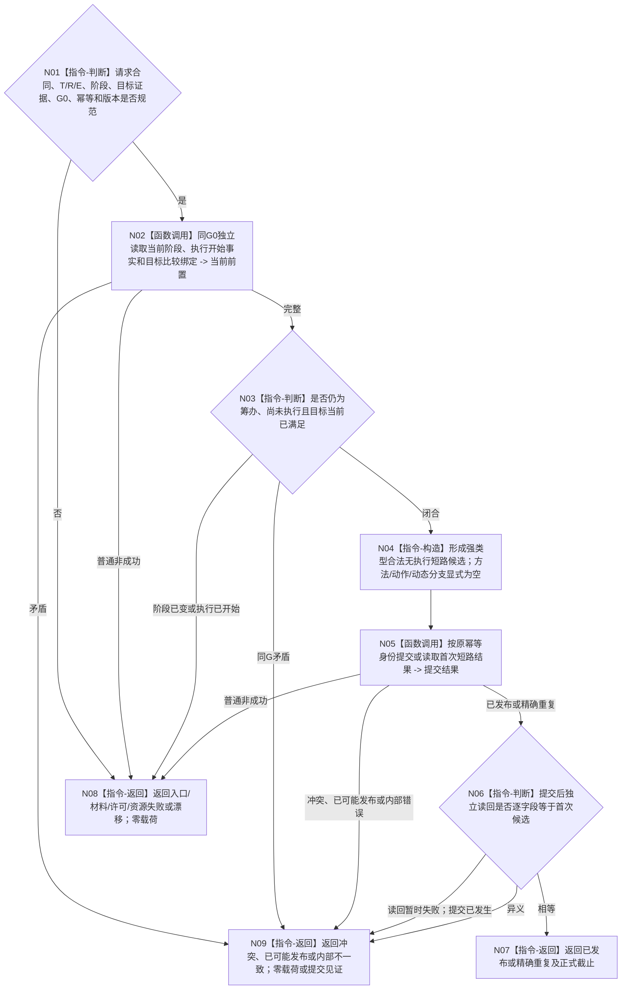

# BIZ-L3-004-17-01 发布或读取合法无执行短路结果目标函数流程图 v0.1

更新时间：2026-08-27

## 依据

```text
3200、4260 v0.9、5090 v0.7、5210 v1.1、5230 v1.2
父图：BIZ-L2-004-17 v0.1
```

## 身份与边界

正式目标函数设计图。函数是合法无执行短路结果的唯一生产 / 幂等读回入口。它只在当前任务轮次仍处于筹办、执行尚未开始且 fresh 目标比较已满足时发布一项强类型短路结果；不发布方法执行事实、需求满足、任务轮次收束或阶段迁移。

## 函数合同

```text
根函数：任务零动作结果提供者::发布或读取合法无执行短路结果
归属模块 / 文件 / 目标分解深度：任务零动作结果owner / 海中鱼巣/领域/内部治理/服务.任务零动作结果.ixx / BIZ-L3
现有或待新增：待新增公开领域入口
完整签名：任务合法无执行短路结果发布结果 任务零动作结果提供者::发布或读取合法无执行短路结果(const 任务合法无执行短路结果发布请求& 请求) noexcept
参数：T/R、当前正式E与阶段、fresh目标比较证据、当前T→D同义目标投影、共同来源截止、运行代次、幂等身份、合同/规则版本和必要零动作归因材料
返回结果：已发布、精确重复、入口/许可拒绝、材料不足、当前性/版本漂移、幂等冲突、资源失败、已可能发布或内部不一致；成功携带首次完整短路结果和正式读回截止
被调函数流程图：DATA提供者合同待详细设计展开；本图冻结业务入口
```

## 流程图



## 关键边界

- “未执行”必须由正式执行开始事实0项完整读回证明；没有线程回执或没有完成消息不能单独证明未执行。
- 同一幂等身份和完整请求逐字段相等才是精确重复；同键不同目标证据、截止、轮次或规则版本均为冲突。
- 发布未知只能用原键和原完整请求收敛，不得换键补发。
