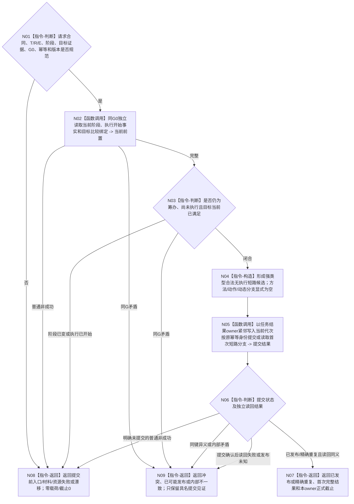

# BIZ-L3-004-17-01 发布或读取合法无执行短路结果目标函数流程图 v0.2

更新时间：2026-08-27

## 依据与替代

```text
3200、4260、5090、5210、5230
用户2026-08-27裁决：任务结果不分配；零动作只形成本任务自己的正式短路结果
父图：BIZ-L2-004-17 v0.3
```

本图完整替代 v0.1。v0.2 明确来源截止 `G0` 与短路结果 owner 的提交 / 正式读回截止分账，并把提交确认后的读回失败固定为“已可能发布 + 提交见证”，不得退化为普通资源失败或零写。

## 身份与边界

用户已裁决的正式目标业务图。函数是合法无执行短路结果的唯一业务生产 / 幂等读回组合入口，但不是第二结果owner。它只在当前任务轮次仍处于筹办、执行尚未开始且 fresh 目标比较已满足时，通过同一任务结果owner发布一项与实际执行结果互斥的强类型短路分支；不发布方法执行事实、需求满足、任务轮次收束或阶段迁移。

## 函数合同

```text
根函数：任务零动作结果提供者::发布或读取合法无执行短路结果
归属模块 / 文件 / 目标分解深度：任务零动作结果业务组合 / 海中鱼巣/领域/内部治理/服务.任务零动作结果.ixx（候选） / BIZ-L3
现有或待新增：目标业务入口待新增；同一任务结果owner的互斥分支DTO、公开写读、幂等和读回ABI尚未正式冻结，当前不得施工
完整签名：任务合法无执行短路结果发布结果 任务零动作结果提供者::发布或读取合法无执行短路结果(const 任务合法无执行短路结果发布请求& 请求) noexcept
参数：T/R、当前正式E与阶段、fresh目标比较证据、当前T→D同义目标投影、来源读取截止G0、运行代次、幂等身份、合同/规则版本和必要零动作归因材料
返回结果：已发布、精确重复、入口拒绝、材料不足、当前性/版本漂移、幂等冲突、资源失败、已可能发布或内部不一致；成功携带首次完整短路结果和任务结果owner正式读回截止，已可能发布只携带提交见证
被调函数流程图：同一ARCH-L4任务结果owner的合法无执行短路分支公开写读待详细设计展开；不得下沉为DATA业务裁决
```

## 流程图



## 关键边界

- “未执行”必须由正式执行开始事实 0 项完整读回证明；没有线程回执或没有完成消息不能单独证明未执行。
- `G0` 是来源读取截止，不等于短路结果 owner 的提交或正式读回截止；结果同时保存其来源 `G0` 绑定。
- 同一幂等身份和完整请求逐字段相等才是精确重复；同键不同目标证据、来源截止、轮次或规则版本均为冲突。
- 提交确认后读回失败必须返回 `已可能发布 + 短路结果提交见证`；只能用原键和原完整请求收敛，不得换键补发。
- 正式实际执行结果与合法无执行短路结果必须由同一任务结果owner保证同一T/R恰一当前；本组合器不得建立第二持久owner或第二当前索引。
- 新合同不得产生旧`许可拒绝`；旧数值只供历史ABI和持久材料解码。
- 本图冻结业务步骤，不冻结尚缺的owner互斥分支DTO和物理ABI；HEAD正式规范同步前不得标为可施工。
