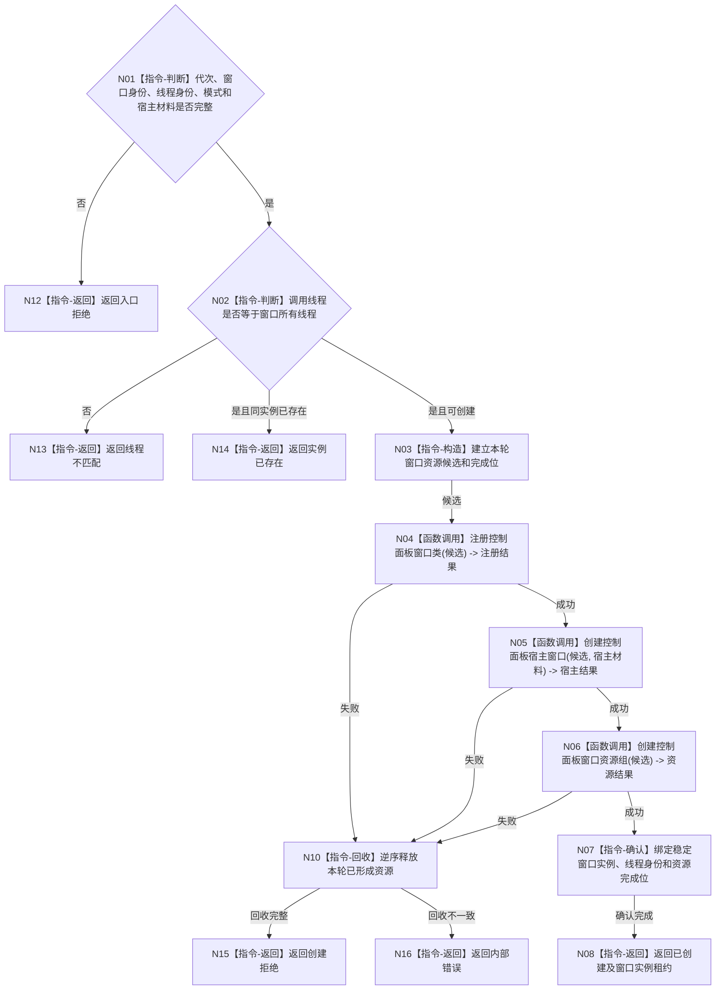

# BIZ-L3-005-01-01 创建窗口运行载体目标函数流程图 v0.1

更新时间：2026-08-03

## 依据

```text
8110、8120；BIZ-L2-005-01
当前能力候选：控制面板窗口::运行、控制面板窗口::窗口实现::运行
```

## 身份与边界

正式目标函数设计图。只在控制面板线程上建立一个具名窗口实例的运行载体；部分创建失败必须回收本轮候选，不读取或修改业务事实。

## 函数合同

```text
根函数：控制面板窗口端口::创建窗口运行载体
归属模块 / 文件 / 层级：控制面板窗口 / 海中鱼巣/界面/控制面板窗口.cpp / L3
现有或待新增：适配扩展；复用现有Win32/WebView2窗口资源创建能力，新增稳定窗口实例与结构化候选收口
完整签名：控制面板窗口载体创建结果 控制面板窗口端口::创建窗口运行载体(const 控制面板窗口载体创建请求& 请求)
参数：请求为只读借用；含运行代次、窗口实例稳定身份、显示模式、当前控制面板线程逻辑身份和宿主句柄材料
返回结果：调用方拥有的值式结果；含已创建、实例已存在、线程不匹配、创建拒绝或内部错误，以及窗口实例租约、资源完成位和诊断句柄
被调函数流程图：BIZ-L4-005-01-01-01 注册控制面板窗口类；BIZ-L4-005-01-01-02 创建控制面板宿主窗口；BIZ-L4-005-01-01-03 创建控制面板窗口资源组
父图：BIZ-L2-005-01
```

## 流程图



## 节点合同

| 节点 | 类型 | 参数 / 输入绑定 | 结果 / 输出绑定 | 事实读写 | 后继条件 | 验证 |
| --- | --- | --- | --- | --- | --- | --- |
| N03—N06 | 指令/函数调用 | 创建请求与本轮候选 | 注册、宿主和资源结果 | 只创建UI资源 | 全部成功或回收 | 部分初始化、类已注册、句柄失败 |
| N07/N08 | 指令 | 完整候选 | 稳定实例租约 | 只写窗口运行状态 | 绑定完成 | 线程亲和、代次、实例唯一 |
| N10 | 指令 | 完成位 | 回收结果 | 释放UI资源 | 完整或不一致 | 逆序、幂等、无业务副作用 |

## 关键边界

窗口实例身份是进程内运行身份；本地句柄只作实现材料。创建成功不证明投影可读、页面已显示或业务闭环成立。
