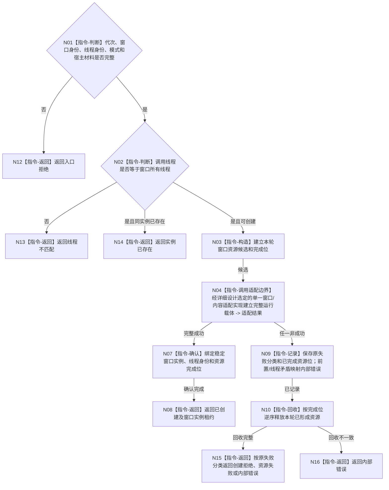

# BIZ-L3-005-01-01 创建窗口运行载体目标函数流程图 v0.2

更新时间：2026-08-28

## 依据

```text
8110 v0.3、8120 v0.10；BIZ-L2-005-01 v0.2
发布源码证据基线 `472914a8`：不存在控制面板线程、窗口或界面目录生产实现
```

## 身份与边界

正式目标函数设计图。只在冻结拓扑选定的窗口所有线程上建立一个具名窗口实例的运行载体；部分创建失败必须回收本轮候选，不读取或修改业务事实。该线程可以是主宿主线程，也可以是后继正式选择的独立T05线程。

## 函数合同

```text
根函数：控制面板窗口端口::创建窗口运行载体
归属模块 / 文件 / 目标分解深度：控制面板窗口职责 / 物理模块与文件待窗口宿主及内容技术详细设计冻结 / BIZ-L3
现有或待新增：待新增；平台窗口、内容呈现和交互适配资源均无当前实现
候选签名（非ABI冻结）：控制面板窗口载体创建结果 控制面板窗口端口::创建窗口运行载体(const 控制面板窗口载体创建请求& 请求) noexcept
参数：请求为只读借用；含运行代次、窗口实例稳定身份、显示模式、冻结拓扑选定的窗口所有线程身份和宿主材料
返回结果：调用方拥有的值式结果；含已创建、实例已存在、入口拒绝、线程不匹配、创建拒绝、资源失败或内部错误，以及窗口实例租约、资源完成位和诊断句柄
被调函数流程图：无；平台注册、宿主窗口和内容资源的真实项目函数边界尚未冻结，旧三个BIZ-L4候选退出当前目标子树
父图：BIZ-L2-005-01
```

## 流程图



## 节点合同

| 节点 | 类型 | 参数 / 输入绑定 | 结果 / 输出绑定 | 事实读写 | 后继条件 | 验证 |
| --- | --- | --- | --- | --- | --- | --- |
| N03/N04 | 指令/适配边界 | 创建请求与本轮候选 | 选定实现返回的完整载体或具名非成功 | 只创建UI资源 | 全部成功或回收 | 部分初始化、平台失败、资源失败 |
| N07/N08 | 指令 | 完整候选 | 稳定实例租约 | 只写窗口运行状态 | 绑定完成 | 线程亲和、代次、实例唯一 |
| N10 | 指令 | 完成位 | 回收结果 | 释放UI资源 | 完整或不一致 | 逆序、幂等、无业务副作用 |

## 关键边界

窗口实例身份是进程内运行身份；本地句柄只作实现材料。创建成功不证明投影可读、内容已经显示或业务闭环成立。资源组只冻结完整性和回收边界，不冻结WebView、HTML或原生控件等具体技术。

本图只冻结“一个选定适配实现必须完整建立或完整回收”的业务后置条件，不冻结窗口类、宿主窗口、控件树、资源类型或项目函数数量。
