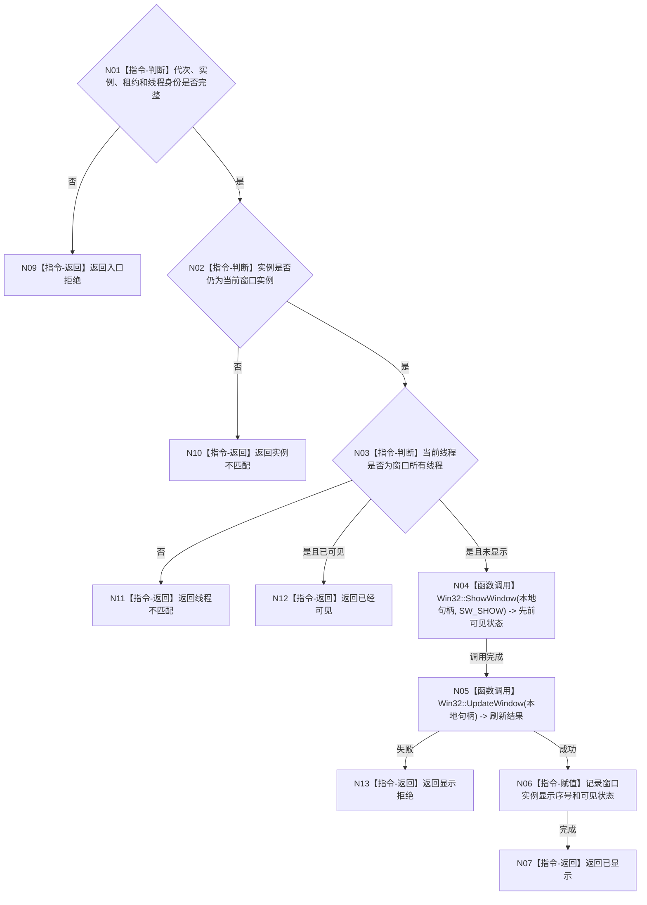

# BIZ-L3-005-01-02 显示窗口目标函数流程图 v0.2

更新时间：2026-08-27

## 依据

```text
8110 v0.3、8120 v0.10；BIZ-L2-005-01 v0.2
HEAD 5bcc121d：不存在控制面板线程或窗口显示生产实现
```

## 身份与边界

正式目标函数设计图。只把已完整创建且属于当前线程的窗口实例切换为可见；不生成业务事实或线程进入见证。

## 函数合同

```text
根函数：控制面板窗口端口::显示窗口
归属模块 / 文件 / 目标分解深度：控制面板窗口 / 海中鱼巣/界面/控制面板窗口.cpp / BIZ-L3
现有或待新增：待新增；ShowWindow/UpdateWindow仅为未来Windows叶子边界
完整签名：控制面板窗口显示结果 控制面板窗口端口::显示窗口(const 控制面板窗口显示请求& 请求) noexcept
参数：请求为只读借用；含运行代次、窗口实例稳定身份、窗口实例租约和预期所有线程身份
返回结果：值式结果；含已显示、已经可见、实例不匹配、线程不匹配、显示拒绝或内部错误，以及窗口实例身份和显示序号
被调函数流程图：无；平台窗口显示调用和状态核对均为本函数内具体指令
父图：BIZ-L2-005-01
```

## 流程图



## 节点合同

| 节点 | 类型 | 参数 / 输入绑定 | 结果 / 输出绑定 | 事实读写 | 后继条件 | 验证 |
| --- | --- | --- | --- | --- | --- | --- |
| N02/N03 | 指令 | 实例租约与当前线程 | 显示资格 | 只读窗口状态 | 当前实例且线程匹配 | 关闭竞争、跨线程调用 |
| N04/N05 | 函数调用 | 本地句柄 | 平台显示结果 | UI副作用 | 调用完成 | 无效句柄、刷新失败 |
| N06/N07 | 指令 | 成功平台结果 | 显示序号 | 只写窗口运行状态 | 完成 | 重复显示幂等 |

## 关键边界

显示成功只是UI运行结果，不得充当控制面板线程进入、初始化成功或任何业务事实的证明。
