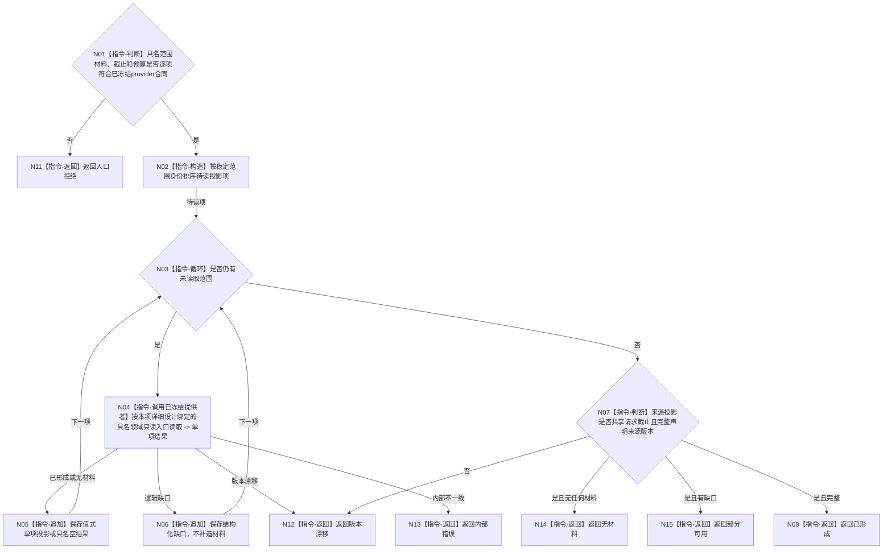

# BIZ-L3-005-03-01 读取具名业务投影目标函数流程图 v0.2

更新时间：2026-08-28

## 依据

```text
4020、4030、8120 v0.10；BIZ-L2-005-03 v0.2
HEAD 4a8972db：不存在控制面板投影服务、正式业务投影provider集合或提供者注册表；各领域公开只读入口只能在逐项设计后复用
```

## 身份与边界

正式目标职责图。按请求中的具名投影范围调用详细设计逐项冻结的领域只读提供者，形成同一事实截止下的值式业务投影组；不直连DATA-L1、SQL、日志或缓存补造事实。当前provider集合、每项强类型键、版本/完整性和分页合同未冻结，因此本函数的物理ABI仍是具名设计缺口。

## 函数合同

```text
根函数：控制面板投影服务::读取具名业务投影
归属模块 / 文件 / 目标分解深度：控制面板业务投影职责 / 物理模块与文件待provider集合及强类型键详细设计冻结 / BIZ-L3
现有或待新增：待新增且ABI待冻结；不得仅凭函数存在把任意领域读取入口自动登记为控制面板投影提供者
候选签名（非ABI冻结）：控制面板业务投影读取结果 控制面板投影服务::读取具名业务投影(const 控制面板业务投影读取请求& 请求) const noexcept
参数：请求为只读借用；最低含具名显示范围材料、事实截止和读取预算；范围项、各provider强类型读取键/版本、分页和游标是否需要及其字段顺序尚待详细设计冻结
返回结果：调用方拥有的不可变值式结果；含已形成、部分可用、无材料、版本漂移、入口拒绝或内部错误，以及来源投影组、缺口组和事实截止见证
被调函数流程图：无；各具名领域provider在详细设计逐项冻结后直接形成真实调用边，旧通用调度器BIZ-L4候选退出
父图：BIZ-L2-005-03
```

## 流程图



## 节点合同

| 节点 | 类型 | 参数 / 输入绑定 | 结果 / 输出绑定 | 事实读写 | 后继条件 | 验证 |
| --- | --- | --- | --- | --- | --- | --- |
| N02—N04 | 指令/函数调用 | 具名范围和同一截止 | 单项投影 | 只读具名领域服务 | 单项具名结果 | 提供者缺失、分页、确定顺序 |
| N05/N06 | 指令 | 单项结果 | 投影组或缺口组 | 无写入 | 继续循环 | 不用默认值补齐 |
| N07/N08 | 指令 | 全部来源结果 | 完整投影见证 | 无写入 | 版本一致 | 混代、遗漏来源版本 |

## 关键边界

控制面板投影服务是读取组合器，不是业务事实所有者。只有经后继详细设计逐项冻结且能在请求G返回完整来源见证的领域公开只读入口可以接入；旧值槽、隐式最新和跨仓非一致读取不能直接继承。当前候选流程不得冒充provider集合或ABI已经冻结。

是否采用直接强类型组合、有限静态适配或其它形态由详细设计裁决；BIZ层不预建注册表、运行时发现或第二路由权威。
