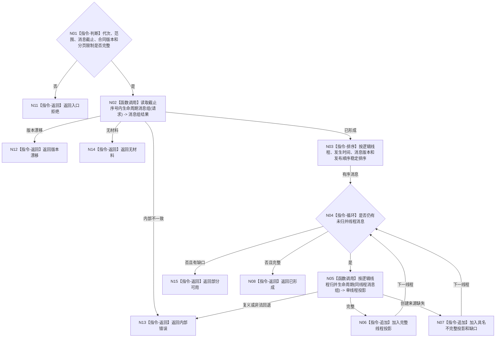

# BIZ-L3-005-03-02 读取线程生命周期投影目标函数流程图 v0.1

更新时间：2026-08-03

## 依据

```text
8110；BIZ-L2-005-03；BIZ-L3-004-15-02
```

## 身份与边界

正式目标函数设计图。按逻辑线程身份和消息顺序形成只读生命周期投影；迟到旧消息不能覆盖不可逆状态，缺失创建来源只能形成具名不完整投影。

## 函数合同

```text
根函数：线程生命周期投影服务::读取线程生命周期投影
归属模块 / 文件 / 层级：线程生命周期投影 / 海中鱼巣/线程/服务.线程生命周期投影.ixx / L3
现有或待新增：待新增；消费8110共用生命周期消息队列的已发布视图
完整签名：线程生命周期投影读取结果 线程生命周期投影服务::读取线程生命周期投影(const 线程生命周期投影读取请求& 请求) const
参数：请求为只读借用；含运行代次、线程范围、消息截止序号、投影合同版本和分页限制
返回结果：调用方拥有的不可变值式结果；含已形成、部分可用、无材料、版本漂移、入口拒绝或内部错误，以及线程投影组、缺口组和消息截止见证
被调函数流程图：BIZ-L4-005-03-02-01 读取截止序号内生命周期消息组；BIZ-L4-005-03-02-02 按逻辑线程归并生命周期
父图：BIZ-L2-005-03
```

## 流程图



## 节点合同

| 节点 | 类型 | 参数 / 输入绑定 | 结果 / 输出绑定 | 事实读写 | 后继条件 | 验证 |
| --- | --- | --- | --- | --- | --- | --- |
| N02 | 函数调用 | 截止和范围 | 已发布消息组 | 只读线程消息链 | 具名结果 | 候选不可见、分页稳定 |
| N03—N05 | 指令/函数调用 | 有序同线程消息 | 单线程投影 | 无业务写入 | 完整、缺口或错误 | 迟到旧消息、不可逆状态 |
| N06/N07 | 指令 | 单线程结果 | 投影组与缺口组 | 无写入 | 继续循环 | 系统线程ID仅诊断 |

## 关键边界

线程投影只服务可见性和诊断；线程堵塞、退出或故障不得映射为任务等待、完成或失败。
