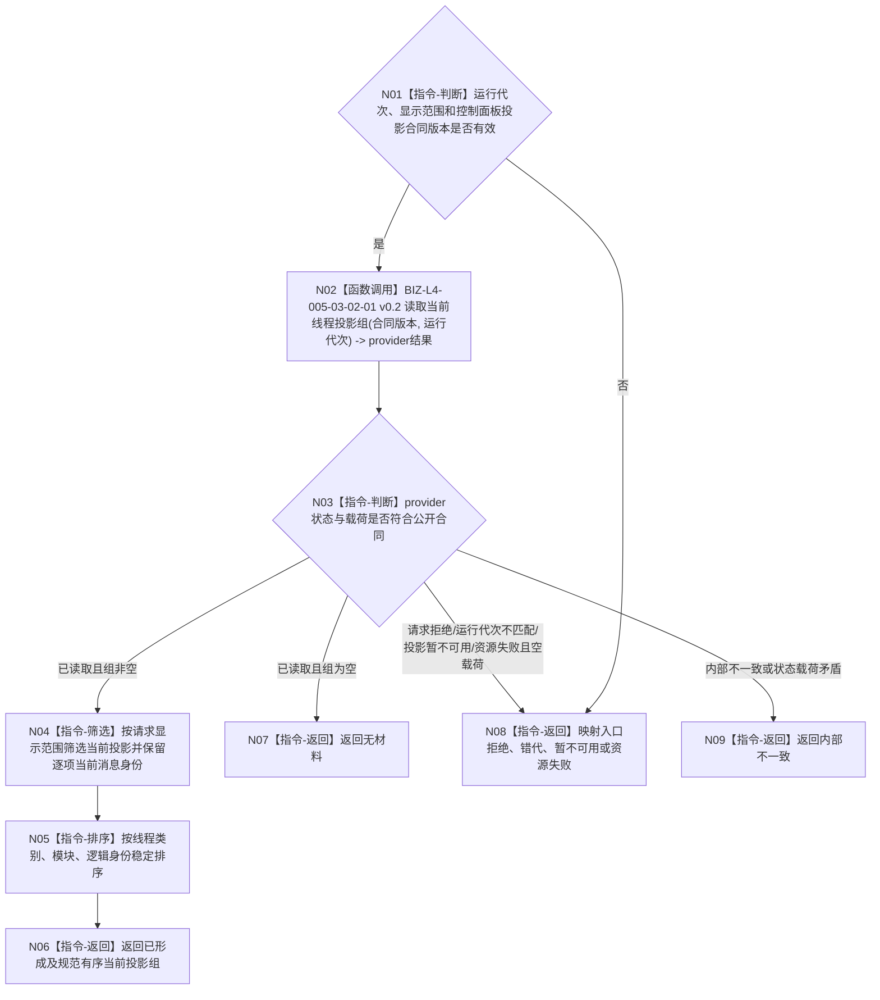

# BIZ-L3-005-03-02 读取线程生命周期投影目标函数流程图 v0.2

更新时间：2026-08-28

## 依据

```text
4050、8110 v0.3；BIZ-L2-005-03 v0.2
发布源码证据基线 `472914a8`：线程生命周期投影读取端口与读取当前线程投影组已经发布；控制面板组合器未实现
```

## 身份与边界

正式目标函数设计图。根函数经已发布读取端口按运行代次取得当前线程投影组，再按显示范围纯值筛选。消息账、迟到链、不可逆状态和当前性已经由唯一provider在发布事务内维护；控制面板不得读取原始消息账或再次归并生命周期。

## 函数合同

```text
根函数：控制面板投影服务::读取线程生命周期投影
归属模块 / 文件 / 目标分解深度：控制面板线程投影适配职责 / 组合器物理模块与文件待详细设计冻结 / BIZ-L3
现有或待新增：目标组合器待新增；直接复用已发布线程生命周期投影读取端口
候选签名（非ABI冻结）：控制面板线程投影读取结果 控制面板投影服务::读取线程生命周期投影(const 控制面板线程投影读取请求& 请求) const noexcept
参数：请求为只读借用；含运行代次、可空线程类别/逻辑身份显示范围和控制面板投影合同版本；不携带DATA-L1事实截止或原始消息截止
返回结果：值式结果；含已形成、无材料、入口拒绝、运行代次不匹配、投影暂不可用、资源失败或内部不一致，以及规范有序当前投影组和逐项当前消息身份
被调函数流程图：BIZ-L4-005-03-02-01 v0.2 线程生命周期投影读取端口::读取当前线程投影组
父图：BIZ-L2-005-03
```

## 流程图



## 节点合同

| 节点 | 类型 | 参数 / 输入绑定 | 结果 / 输出绑定 | 事实读写 | 后继条件 | 验证 |
| --- | --- | --- | --- | --- | --- | --- |
| N02/N03 | 函数调用/判断 | 运行代次 | provider当前投影组 | 只读唯一线程投影provider | 公开状态闭合 | 空组、锁竞争、错代、内部错误 |
| N04—N06 | 指令 | 当前投影组和显示范围 | 规范有序人读线程投影 | 无写入 | 筛选闭合 | 逻辑身份唯一、当前消息保留 |

## 关键边界

线程投影只服务可见性和诊断；线程堵塞、退出或故障不得映射为任务等待、完成或失败。旧BIZ-L4-005-03-02-01/02 v0.1原始消息视图与二次归并目标退出当前子树。
