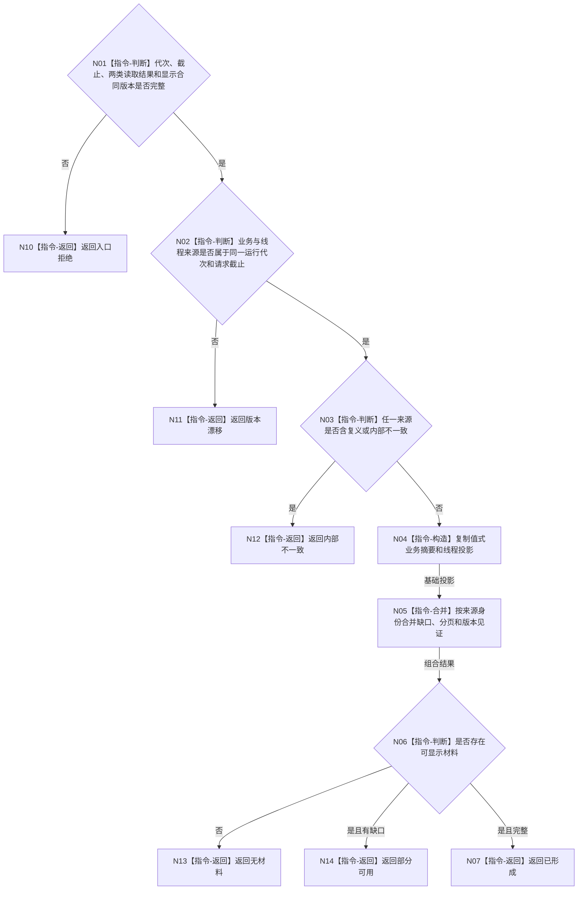

# BIZ-L3-005-03-03 组合控制面板人读投影目标函数流程图 v0.1

更新时间：2026-08-03

## 依据

```text
4020、4030、8110、8120；BIZ-L2-005-03
```

## 身份与边界

正式目标函数设计图。纯值组合业务投影、线程投影和缺口，不读取新来源、不补造缺失事实，也不把显示字段升级为机器字段。

## 函数合同

```text
根函数：组合控制面板人读投影
归属模块 / 文件 / 层级：控制面板投影组合 / 海中鱼巣/领域/组合.控制面板投影.ixx / L3
现有或待新增：待新增纯值组合函数；复用既有显示材料结构但不继承旧权威含义
完整签名：控制面板组合投影结果 组合控制面板人读投影(const 控制面板组合投影请求& 请求) noexcept
参数：请求为只读借用；含运行代次、请求截止、业务投影读取结果、线程投影读取结果、显示合同版本和分页元数据
返回结果：值式结果；含已形成、部分可用、无材料、版本漂移、入口拒绝或内部不一致，以及不可变控制面板投影、缺口组和来源见证组
被调函数流程图：无；版本互证、缺口合并和DTO构造均为本函数内纯值指令
父图：BIZ-L2-005-03
```

## 流程图



## 节点合同

| 节点 | 类型 | 参数 / 输入绑定 | 结果 / 输出绑定 | 事实读写 | 后继条件 | 验证 |
| --- | --- | --- | --- | --- | --- | --- |
| N02/N03 | 指令 | 两类来源见证 | 组合资格 | 无写入 | 同代次、无复义 | 混代、内部错误 |
| N04/N05 | 指令 | 值式来源 | 人读投影和缺口 | 无写入 | 构造完成 | 空字段不补默认值 |
| N06/N07 | 指令 | 组合结果 | 结构化状态 | 无写入 | 完整、部分或无材料 | 结果边界稳定 |

## 关键边界

“同一截止”是读取合同和来源见证的一致性约束，不意味着业务事实与线程投影共享一个权威事务。组合结果不得参与恢复、业务准入或反向写入。

