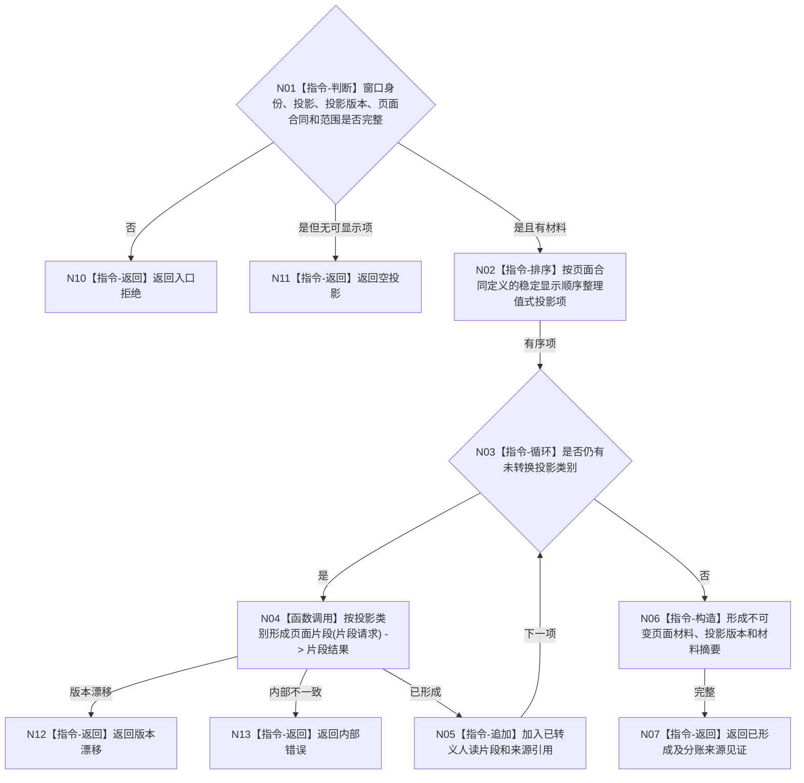

# BIZ-L3-005-04-01 序列化控制面板人读投影目标函数流程图 v0.2

更新时间：2026-08-27

## 依据

```text
4020、8110 v0.3、8120 v0.10；BIZ-L2-005-04 v0.2
HEAD d8a692af：不存在控制面板页面材料生成实现
```

## 身份与边界

正式目标函数设计图。把不可变控制面板投影转换为页面材料；转换只影响人读表示，不解释文本、颜色或布局为机器语义。

## 函数合同

```text
根函数：序列化控制面板人读投影
归属模块 / 文件 / 层级：控制面板页面投影 / 海中鱼巣/界面/投影.控制面板页面.ixx / L3
现有或待新增：待新增；HEAD无现有控制面板显示材料生成能力
完整签名：控制面板页面材料形成结果 序列化控制面板人读投影(const 控制面板页面材料形成请求& 请求)
参数：请求为只读借用；含窗口实例身份、页面刷新身份、不可变控制面板投影、业务/线程分账来源见证、页面合同版本和显示范围
返回结果：调用方拥有的值式结果；含已形成、空投影、版本漂移、入口拒绝或内部错误，以及不可变页面材料、分账来源见证和页面材料摘要
被调函数流程图：BIZ-L4-005-04-01-01 按投影类别形成页面片段
父图：BIZ-L2-005-04
```

## 流程图



## 节点合同

| 节点 | 类型 | 参数 / 输入绑定 | 结果 / 输出绑定 | 事实读写 | 后继条件 | 验证 |
| --- | --- | --- | --- | --- | --- | --- |
| N02—N04 | 指令/函数调用 | 值式投影和页面合同 | 页面片段 | 人读转换 | 具名结果 | 特殊字符、空材料、版本 |
| N05/N06 | 指令 | 已转义片段 | 不可变页面材料 | 无业务写入 | 构造完成 | 来源引用完整、确定排序 |
| N07 | 返回 | 页面材料 | 已形成 | 无写入 | 终止 | 文本不承载机器语义 |

## 关键边界

页面材料摘要只用于传输和刷新判重，不是业务事实摘要。业务事实截止与线程当前消息身份必须分别保留；HTML、文本、颜色和控件状态不得被任何业务入口反向解析。
