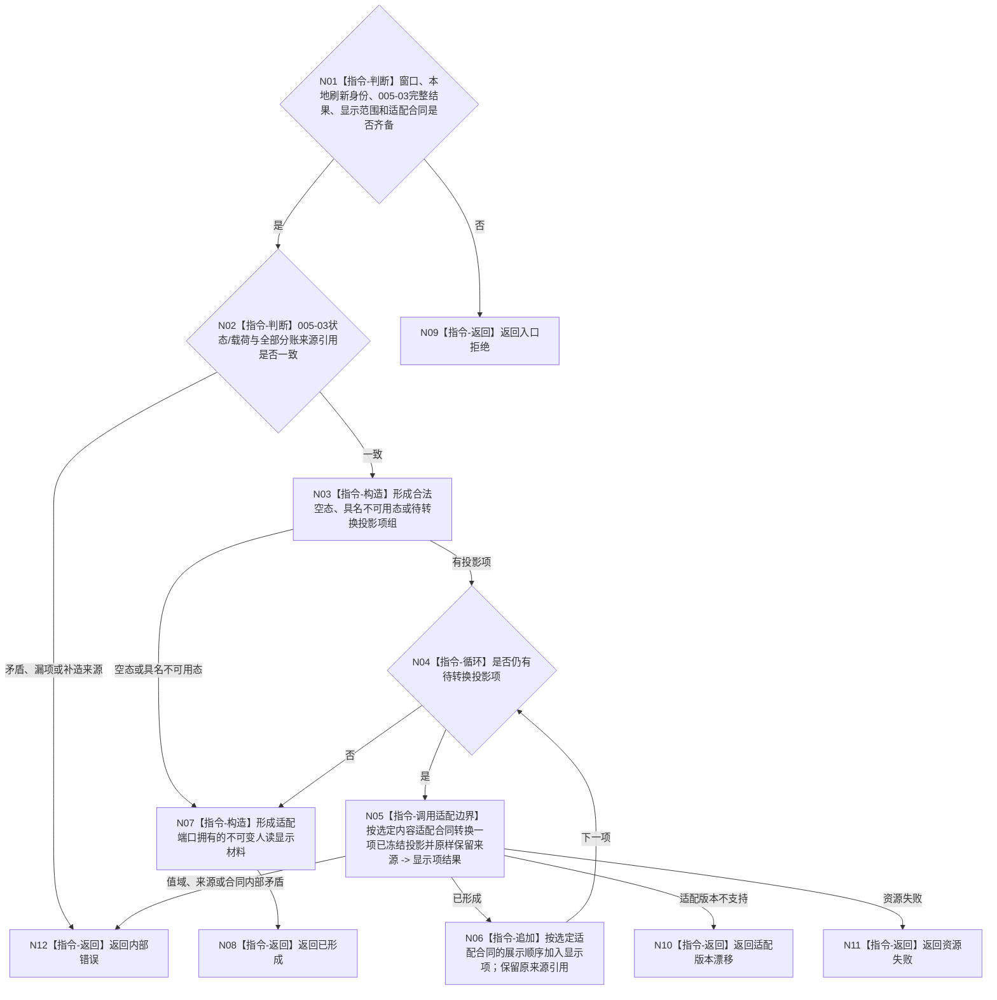

# BIZ-L3-005-04-01 形成控制面板人读显示材料目标函数流程图 v0.2

更新时间：2026-08-28

## 依据

```text
4020、8110 v0.3、8120 v0.10；BIZ-L2-005-04 v0.2
BIZ-L2-005-03 v0.2
发布源码证据基线 `472914a8`：不存在控制面板内容适配或人读显示材料生产实现
```

## 身份与边界

正式目标职责图。该目标经 BIZ-L2-005-01 已选定的单一内容适配端口，把005-03的完整值式结果转换为当前窗口可消费的人读显示材料。转换只改变表示，不取得业务事实、线程事实或跨证据域共同截止。

005-03尚未冻结业务 provider 集合和最终结果 ABI，8120也未选择内容技术，因此本图不冻结页面模型、字段排列、HTML、JSON、控件树、模板、颜色、排序或折叠规则；候选函数与 DTO 只有在这两个直接依赖闭合后才能成为可施工合同。

## 函数合同

```text
根目标：经单一内容适配端口形成控制面板人读显示材料
归属模块 / 文件 / 目标分解深度：控制面板内容适配实现 / 具体文件待详细设计选择 / BIZ-L3
现有或待新增：待新增；职责已冻结，物理函数身份与 ABI 待详细设计
候选签名（非ABI冻结）：控制面板人读显示材料形成结果 内容适配端口::形成人读显示材料(const 控制面板人读显示材料形成请求& 请求)
参数最低职责：窗口实例、本地刷新身份、005-03完整值式结果、选定内容适配合同版本和显示范围
返回结果最低分类：已形成、入口拒绝、适配版本漂移、资源失败、内部错误；成功载荷为适配端口拥有的不可变显示材料及原样分账来源引用
被调目标：无；投影项联合与内容技术未冻结，逐项转换器不得先于详细设计成为正式BIZ-L4叶
父图：BIZ-L2-005-04
施工门禁：005-03输出ABI、显示范围和单一内容适配合同已冻结
```

## 流程图



## 节点合同

| 节点 | 类型 | 参数 / 输入绑定 | 结果 / 输出绑定 | 事实读写 | 后继条件 | 验证 |
| --- | --- | --- | --- | --- | --- | --- |
| N01—N03 | 指令 | 005-03完整结果与适配请求 | 空态、不可用态或投影项组 | 纯值读取 | 输入一致 | 空组、部分结果、具名非成功、来源漏失 |
| N05 | 函数调用 | 单项投影、对应来源、适配合同 | 人读显示项 | 纯表示转换 | 具名结果 | 未知类别、未知版本、值域矛盾 |
| N06—N08 | 指令 | 已形成显示项 | 不可变显示材料 | 无业务写入 | 形成完成 | 来源逐项保留、确定展示顺序 |

## 关键边界

- 合法空投影和允许展示的具名不可用结果都是可显示状态，不得改成入口拒绝，也不得由旧缓存补成当前。
- 展示顺序、文本、颜色、布局、分组、折叠和摘要只属于选定内容适配合同；不影响业务新旧、完整性或成功判断。
- 业务事实截止与线程当前消息身份逐项保留，显示层不得比较、归并或伪造成同截止。
- 材料摘要如由具体技术需要，只能用于本地传输或判重，不能成为业务事实摘要、恢复证据或跨进程身份。
- 本图不授权运行时发现任意 provider；收到哪些投影项完全由005-03正式结果决定。

本图完成的是技术中性职责校正；最终物理函数、DTO、适配版本和显示范围仍是详细设计缺口。

旧单项显示转换BIZ-L4只是一种候选拆分，现退出当前目标子树；详细设计可按实际投影联合和选定内容技术决定是否拆分项目函数。
