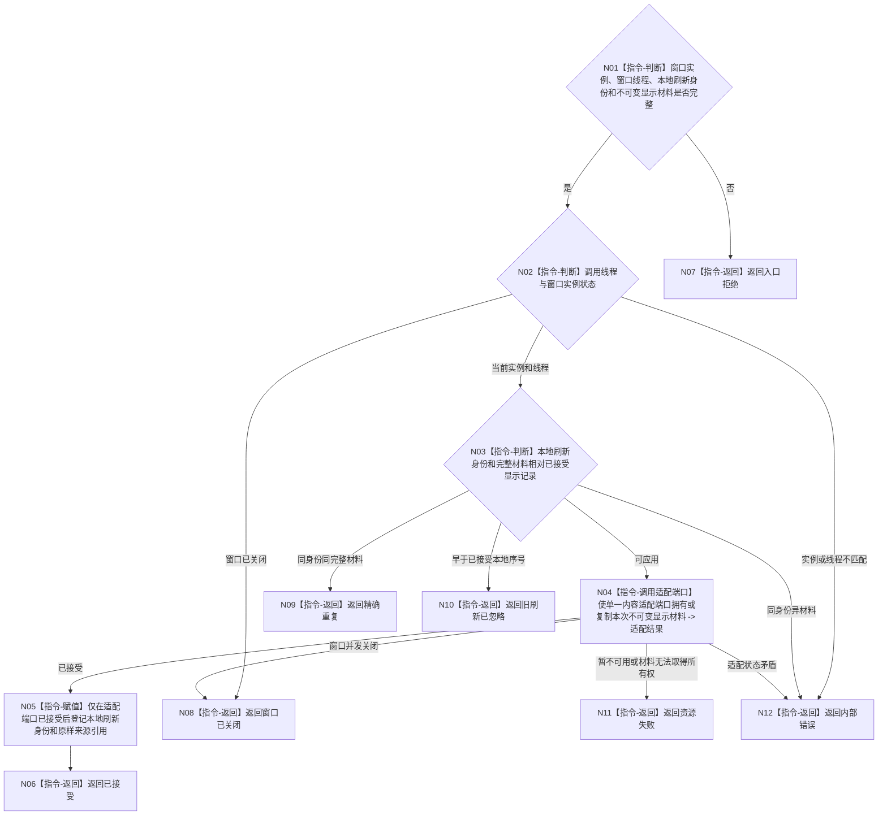

# BIZ-L3-005-04-02 应用控制面板显示刷新目标函数流程图 v0.2

更新时间：2026-08-27

## 依据

```text
8110 v0.3、8120 v0.10；BIZ-L2-005-04 v0.2
BIZ-L4-005-01-01-03 v0.2
HEAD 302fb76c：不存在控制面板内容适配或显示刷新生产实现
```

## 身份与边界

正式目标职责图。该目标在当前窗口所有线程上，经创建窗口资源组时绑定的同一个内容适配端口应用一份不可变人读显示材料，只改变进程内显示状态和 UI 资源。

本图不预选同步渲染、异步队列、平台窗口消息、回调或页面运行环境。“已接受”只证明适配端口已经拥有或复制材料；实际呈现完成与否按选定技术的后继详细设计表达。

## 函数合同

```text
根目标：控制面板窗口端口::应用显示刷新
归属模块 / 文件 / 目标分解深度：控制面板窗口 / 具体文件待内容技术详细设计选择 / BIZ-L3
现有或待新增：待新增；职责已冻结，最终函数签名依赖单一内容适配端口
候选签名：控制面板显示刷新结果 控制面板窗口端口::应用显示刷新(const 控制面板显示刷新请求& 请求) noexcept
参数最低职责：窗口实例身份、本地刷新身份或序号、不可变人读显示材料、材料原样分账来源引用
返回结果最低分类：已接受、精确重复、旧刷新已忽略、窗口已关闭、入口拒绝、资源失败、内部错误
被调函数流程图：无；选定内容适配端口是详细设计后的平台叶边界，不在目标图中伪造项目函数
父图：BIZ-L2-005-04
施工门禁：BIZ-L2-005-01 的单一内容适配技术和本地刷新合同已冻结
```

## 流程图



## 节点合同

| 节点 | 类型 | 参数 / 输入绑定 | 结果 / 输出绑定 | 事实读写 | 后继条件 | 验证 |
| --- | --- | --- | --- | --- | --- | --- |
| N01—N03 | 指令 | 当前窗口、本地刷新身份、完整材料 | 当前、重复、旧、关闭或错误 | 只读窗口显示状态 | 分类完成 | 线程亲和、关闭竞争、同键异义 |
| N04 | 适配端口调用 | 不可变显示材料 | 适配结果 | UI副作用 | 具名结果 | 同步/异步实现均满足所有权边界 |
| N05/N06 | 指令 | 已接受结果 | 本地刷新记录 | 只写进程内显示状态 | 登记后返回 | 失败不推进序号、来源不改写 |

## 关键边界

- 本地刷新身份只在同一窗口实例内排序和判重，不是业务事实版本、线程消息身份或跨窗口持久身份。
- 业务事实截止与线程当前消息身份不得参与本地刷新大小比较；它们只随材料原样保留供人读。
- 适配失败、窗口关闭或乱序忽略均不修改来源投影，也不撤销任何业务事实。
- 是否需要复制、移动、排队、回调和呈现完成通知由选定内容技术冻结；禁止从本图直接实施 `Win32::PostMessage` 或任何等价平台方案。
- “已接受”不等于人已经看到，也不构成线程、任务、需求或系统成功。

本图完成的是技术中性刷新职责校正；最终物理入口和适配结果 ABI 仍待详细设计。
