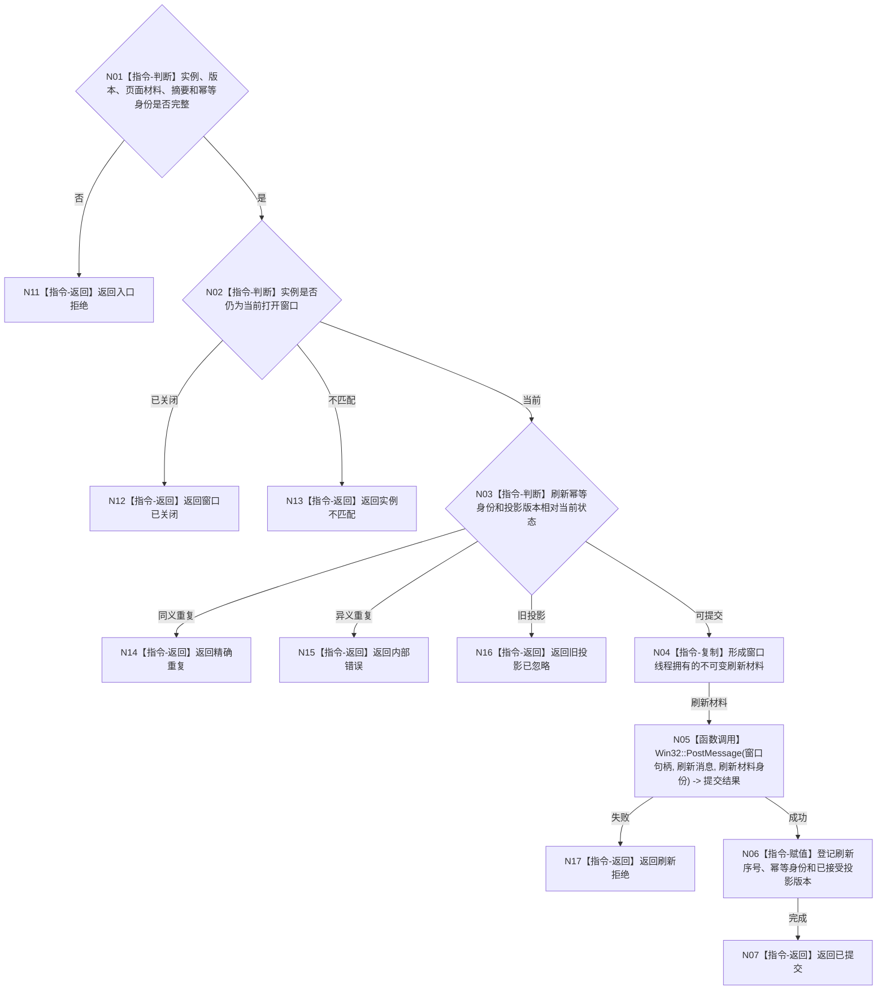

# BIZ-L3-005-04-02 提交控制面板页面刷新目标函数流程图 v0.1

更新时间：2026-08-03

## 依据

```text
8110、8120；BIZ-L2-005-04
```

## 身份与边界

正式目标函数设计图。把不可变页面材料提交给当前窗口实例的异步刷新通道；只产生UI副作用，不回写投影或业务事实。

## 函数合同

```text
根函数：控制面板窗口端口::提交页面刷新
归属模块 / 文件 / 层级：控制面板窗口 / 海中鱼巣/界面/控制面板窗口.cpp / L3
现有或待新增：适配扩展；复用现有页面更新能力，补窗口实例、投影版本、刷新序号和关闭竞争结果
完整签名：控制面板页面刷新结果 控制面板窗口端口::提交页面刷新(const 控制面板页面刷新请求& 请求)
参数：请求为只读借用；含窗口实例身份、投影版本、页面材料、材料摘要、期望已显示版本和刷新幂等身份
返回结果：值式结果；含已提交、精确重复、旧投影已忽略、窗口已关闭、实例不匹配、刷新拒绝或内部错误，以及刷新序号和已接受投影版本
被调函数流程图：无；窗口实例判断、异步消息提交和版本更新均为本函数内具体指令
父图：BIZ-L2-005-04
```

## 流程图



## 节点合同

| 节点 | 类型 | 参数 / 输入绑定 | 结果 / 输出绑定 | 事实读写 | 后继条件 | 验证 |
| --- | --- | --- | --- | --- | --- | --- |
| N02/N03 | 指令 | 窗口与刷新身份 | 提交资格 | 只读窗口状态 | 当前、重复、旧或错误 | 关闭竞争、乱序刷新 |
| N04/N05 | 指令/函数调用 | 页面材料 | 异步窗口消息 | UI副作用 | 平台提交结果 | 复制生命周期、投递失败 |
| N06/N07 | 指令 | 成功提交 | 刷新序号 | 只写窗口显示状态 | 完成 | 幂等与单调版本 |

## 关键边界

“已提交”不等于页面已经渲染；显示失败、窗口关闭或刷新乱序不得修改来源投影，更不得撤销业务事实。

