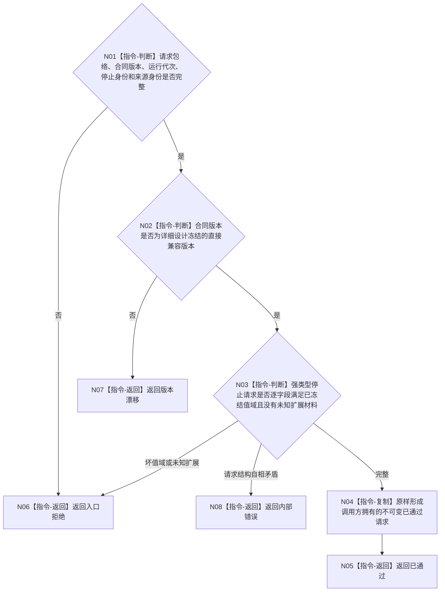

# BIZ-L3-005-05-01 复核程序停止请求目标函数流程图 v0.2

更新时间：2026-08-27

## 依据

```text
4050、8100 v0.7、8120 v0.10；BIZ-L2-005-05 v0.2
BIZ-L2-001-02 v0.3、BIZ-L2-001-10 v0.2
```

## 身份与边界

正式目标职责图。该目标只对一个强类型程序停止请求作确定性纯值复核并原样返回已通过请求，不执行停止、不写邮箱，也不把请求“规范化”为另一份消息。

现行目标只有停止请求一种类型，因此强类型请求的物理布局本身禁止携带线程操作、任务、需求、世界、价值或其它通用命令载荷；不需要运行时扫描“禁止字段”或另造控制隔离见证。完整字段顺序、专属版本和最小诊断材料仍由停止来源详细设计统一冻结。

## 函数合同

```text
根目标：复核程序停止请求
归属模块 / 文件 / 目标分解深度：程序控制停止协议 / 物理模块待详细设计选择 / BIZ-L3
现有或待新增：待新增；纯值职责已冻结，最终函数和DTO待详细设计
候选签名：程序停止请求复核结果 复核程序停止请求(const 程序停止请求复核请求& 请求) noexcept
参数最低职责：停止请求合同版本、非零运行代次、非零停止请求稳定身份、合法来源逻辑身份及已冻结最小诊断材料
返回结果最低分类：已通过、入口拒绝、版本漂移、内部错误；成功载荷为逐字段原样的不可变停止请求
被调函数流程图：无；全部复核为本函数内纯值指令
父图：BIZ-L2-005-05 v0.2
施工门禁：程序停止请求物理字段、版本兼容和来源身份规则已由与001-02/001-10共享的详细设计冻结
```

## 流程图



## 节点合同

| 节点 | 类型 | 参数 / 输入绑定 | 结果 / 输出绑定 | 事实读写 | 后继条件 | 验证 |
| --- | --- | --- | --- | --- | --- | --- |
| N01—N03 | 指令 | 强类型停止请求 | 通过、拒绝、漂移或错误 | 无写入 | 分类完成 | 零代次、零身份、坏来源、错版本、未知扩展 |
| N04/N05 | 指令 | 合法原请求 | 逐字段原样不可变请求 | 无写入 | 形成完成 | 确定性、无默认补齐、无规范化换义 |

## 关键边界

- 复核成功不等于程序控制来源已锁存、T01停止阶段已锁存、线程已停发或进程已退出。
- 纯值复核不得读取窗口状态、线程生命周期投影、任务状态、生存控制态、日志或缓存来补充请求。
- 详细设计若需要可选诊断原因，只能作为不改变停止语义的强类型字段；显示文本、窗口标题和任意字符串不能参与幂等或路由。
- 不建立“规范化消息”或“隔离见证”第二载荷；提交端只消费已通过的同一原完整请求。

本图完成的是纯值复核职责校正；精确协议 ABI 尚未冻结。
