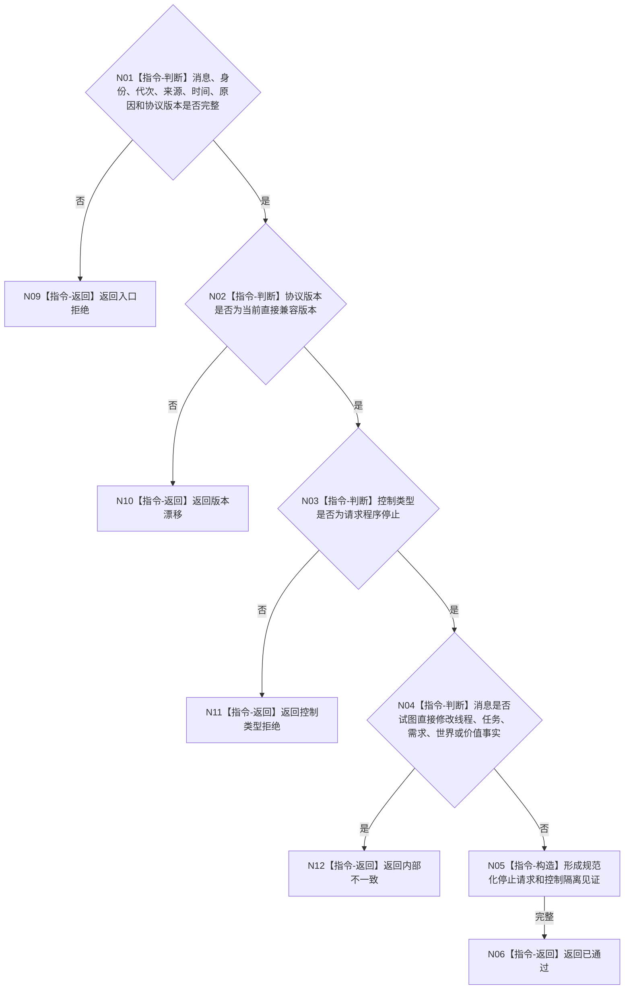

# BIZ-L3-005-05-01 复核程序控制消息目标函数流程图 v0.1

更新时间：2026-08-03

## 依据

```text
4050、8120；BIZ-L2-005-05
```

## 身份与边界

正式目标函数设计图。纯值复核程序控制消息；当前只允许“请求程序停止”，不执行停止动作。

## 函数合同

```text
根函数：复核程序控制消息
归属模块 / 文件 / 层级：程序控制消息协议 / 海中鱼巣/线程/协议.程序控制.ixx / L3
现有或待新增：待新增通用纯值复核函数；现有停止信号只作宿主实现候选
完整签名：程序控制消息复核结果 复核程序控制消息(const 程序控制消息复核请求& 请求) noexcept
参数：请求为只读借用；含不可变控制消息、消息身份、运行代次、控制类型、来源线程逻辑身份、发生时间、原因键和协议版本
返回结果：值式结果；含已通过、入口拒绝、控制类型拒绝、版本漂移或内部不一致，以及规范化不可变消息和控制隔离见证
被调函数流程图：无；字段、类型和禁止载荷复核均为本函数内纯值指令
父图：BIZ-L2-005-05
```

## 流程图



## 节点合同

| 节点 | 类型 | 参数 / 输入绑定 | 结果 / 输出绑定 | 事实读写 | 后继条件 | 验证 |
| --- | --- | --- | --- | --- | --- | --- |
| N01—N03 | 指令 | 控制消息 | 协议资格 | 无写入 | 完整、兼容、允许类型 | 空身份、错代次、未知类型 |
| N04 | 指令 | 消息载荷 | 控制隔离资格 | 无写入 | 仅程序级请求 | 禁止业务写命令 |
| N05/N06 | 指令 | 合法输入 | 规范化消息与见证 | 无写入 | 完成 | 确定性、值式 |

## 关键边界

通过复核不等于停止已锁存、线程已停发或进程已经退出。
