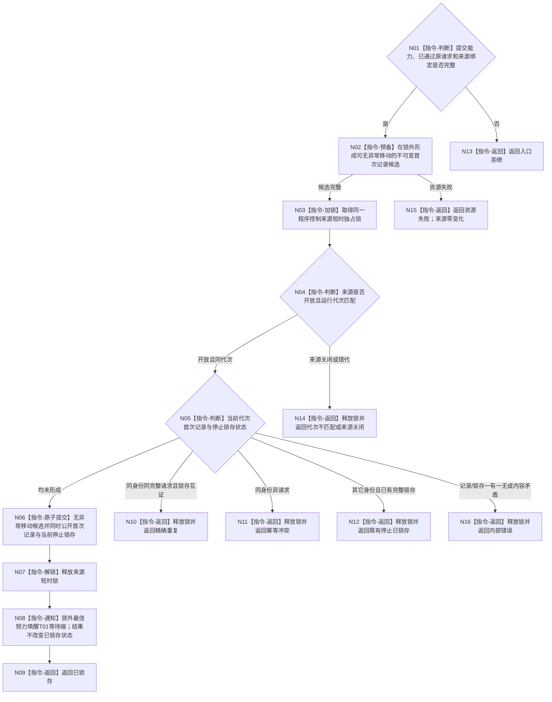

# BIZ-L3-005-05-02 原子提交程序停止锁存与首次记录目标函数流程图 v0.2

更新时间：2026-08-27

## 依据

```text
4050、8100 v0.7、8120 v0.10；BIZ-L2-005-05 v0.2
BIZ-L2-001-02 v0.3、BIZ-L2-001-10 v0.2；BIZ-L3-005-05-01 v0.2
```

## 身份与边界

正式目标职责图。该目标经001-02交付的同一程序控制来源提交端，在一次短临界区内原子形成本运行代次不可变首次停止记录和当前停止锁存。读取端后续只作非破坏性重读；通知只唤醒等待者，不承担权威。

本图不规定锁类型、队列容器、容量值、观察版本或通知机制。当前只存在一份首次停止记录，不需要把每个后到请求入队；后到请求按精确重复、幂等冲突或既有停止已锁存分账。

## 函数合同

```text
根目标：程序控制提交端口::原子提交程序停止锁存与首次记录
归属模块 / 文件 / 目标分解深度：程序控制来源 / 物理模块待详细设计选择 / BIZ-L3
现有或待新增：待新增；必须与001-02构造和001-10读取共享一个拥有体
候选签名：程序停止来源提交结果 程序控制提交端口::原子提交程序停止锁存与首次记录(const 程序停止来源提交请求& 请求) noexcept
参数最低职责：绑定同一来源拥有体的提交能力、已通过原完整停止请求；请求运行代次必须等于来源代次
返回结果最低分类：已锁存、精确重复、既有停止已锁存、入口拒绝、代次不匹配、来源关闭、幂等冲突、资源失败、内部错误
被调函数流程图：无；候选材料预备、短临界区比较/提交和锁外最佳努力通知均为本函数内指令
父图：BIZ-L2-005-05 v0.2
读回后继：BIZ-L3-001-10-01只经来源读取端重读同一锁存和首次记录
施工门禁：来源拥有体、提交/读取租约分面、关闭线性化点、首次记录布局和通知策略已统一冻结
```

## 流程图



## 节点合同

| 节点 | 类型 | 参数 / 输入绑定 | 结果 / 输出绑定 | 事实读写 | 后继条件 | 验证 |
| --- | --- | --- | --- | --- | --- | --- |
| N01/N02 | 判断/预备 | 提交能力与原请求 | 可提交候选或零变化失败 | 锁外候选，不可见 | 候选完整 | 分配失败、异常安全、原请求不改写 |
| N03—N06 | 锁/判断/提交 | 候选与来源当前状态 | 首次、重复、冲突、既有或错误 | 只写同一来源锁存和首次记录 | 线性化完成 | 代次、关闭竞争、幂等优先序、半结构 |
| N07—N09 | 解锁/通知/返回 | 已锁存来源 | 已锁存结果 | 通知无权威写入 | 不等待T01 | 丢失/合并/延迟唤醒仍可重读 |

## 关键边界

- 首次记录与停止锁存必须共享一个线性化点；记录/锁存一有一无是内部错误，不得按未找到、资源失败或既有锁存掩盖。
- 锁外候选形成失败时来源严格零变化；进入原子提交后不得再执行可能失败的分配或复制。
- 精确重复先于“既有停止已锁存”判断，保证原请求重试稳定；同身份异请求必须返回幂等冲突，不能被既有锁存吞掉。
- 新身份在已有完整锁存后只返回既有停止已锁存，不新增第二记录或第二队列项。
- 通知在锁外最佳努力执行。通知失败不能把已锁存降为资源失败或触发回滚；T01按001-10有界观察并非破坏性重读。
- 来源关闭后不得接受首次请求；已有锁存的最终读回和关闭时序由001-02/001-10共享详细设计冻结。

本图完成的是原子停止来源职责校正；精确拥有体、同步原语和 ABI 尚未冻结。
