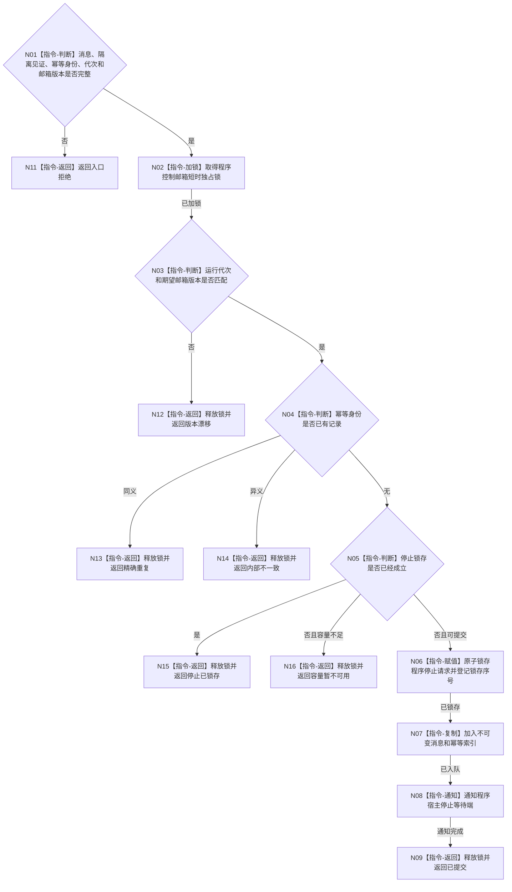

# BIZ-L3-005-05-02 提交不可变程序控制消息目标函数流程图 v0.1

更新时间：2026-08-03

## 依据

```text
4050、8120；BIZ-L2-005-05；BIZ-L3-005-05-01
```

## 身份与边界

正式目标函数设计图。把已复核消息提交给程序宿主邮箱；锁内只做停止锁存、判重和入队，不直接停止线程。

## 函数合同

```text
根函数：程序控制邮箱::提交不可变程序控制消息
归属模块 / 文件 / 层级：程序控制邮箱 / 海中鱼巣/线程/程序控制邮箱.ixx / L3
现有或待新增：待新增；可适配现有停止信号租约为宿主消费端
完整签名：程序控制邮箱提交结果 程序控制邮箱::提交不可变程序控制消息(const 程序控制邮箱提交请求& 请求)
参数：请求为只读借用；含规范化控制消息、控制隔离见证、消息幂等身份、运行代次和期望邮箱版本
返回结果：值式结果；含已提交、精确重复、停止已锁存、容量暂不可用、版本漂移、入口拒绝或内部不一致，以及消息身份、锁存序号和邮箱版本
被调函数流程图：无；短时锁内判重、锁存、入队和通知均为本函数内指令
父图：BIZ-L2-005-05
```

## 流程图



## 节点合同

| 节点 | 类型 | 参数 / 输入绑定 | 结果 / 输出绑定 | 事实读写 | 后继条件 | 验证 |
| --- | --- | --- | --- | --- | --- | --- |
| N02—N05 | 指令 | 请求与邮箱状态 | 提交资格 | 锁内邮箱元数据 | 可提交或具名非成功 | 代次、版本、幂等、锁存 |
| N06/N07 | 指令 | 规范化停止请求 | 锁存与邮箱项 | 只写程序控制链 | 发布完成 | 锁存和消息不可分离 |
| N08/N09 | 指令 | 已发布消息 | 宿主唤醒 | 无业务写入 | 完成 | 不等待线程停止 |

## 关键边界

停止锁存是程序宿主控制状态，不是业务事实；宿主仍须按T01顺序完成停发、排空、接管和连接。
