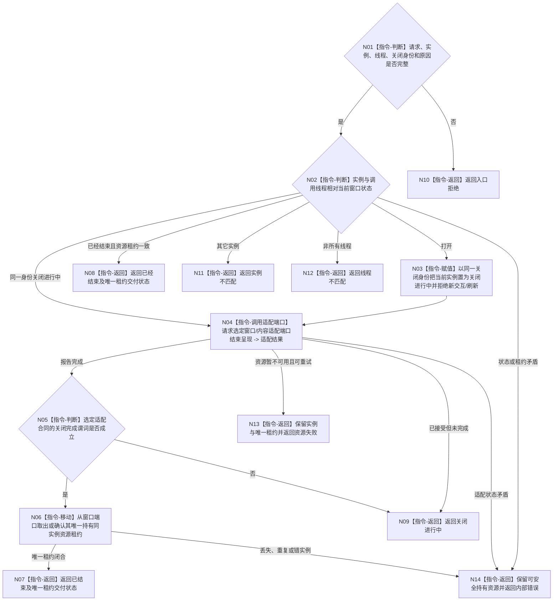

# BIZ-L3-005-06-01 结束当前控制面板窗口呈现目标函数流程图 v0.2

更新时间：2026-08-27

## 依据

```text
8110 v0.3、8120 v0.10；BIZ-L2-005-06 v0.2
BIZ-L2-005-01 v0.2、BIZ-L4-005-01-01-03 v0.2
HEAD 1c13ace8：不存在控制面板窗口或内容适配生产实现
```

## 身份与边界

正式目标职责图。该目标只在窗口所有线程上请求并确认当前实例不再接受交互或显示刷新，然后把该实例的唯一资源租约交给后继释放。它不选择平台关闭函数，不停止程序宿主或其它线程。

同步关闭、异步回调、消息循环继续泵送或平台事件确认均由005-01选定的窗口/内容适配技术在详细设计中冻结；目标图只规定“已结束”必须由选定适配端口的正式完成谓词证明，不能用句柄无效、不可见或请求已投递替代。

## 函数合同

```text
根目标：控制面板窗口端口::结束当前窗口呈现
归属模块 / 文件 / 目标分解深度：控制面板窗口 / 具体文件待窗口与内容技术详细设计选择 / BIZ-L3
现有或待新增：待新增；职责已冻结，最终函数与状态ABI待详细设计
候选签名：控制面板窗口呈现结束结果 控制面板窗口端口::结束当前窗口呈现(const 控制面板窗口呈现结束请求& 请求) noexcept
参数最低职责：运行代次、当前窗口实例、窗口所有线程、关闭请求身份和原因；同一请求用于进行中重试
返回结果最低分类：已结束、已经结束、关闭进行中、入口拒绝、实例不匹配、线程不匹配、资源失败、内部错误；结束类成功携带同实例唯一资源租约或证明端口已唯一持有它
被调函数流程图：无；选定窗口/内容适配端口属于详细设计后的平台叶边界
父图：BIZ-L2-005-06 v0.2
施工门禁：单一窗口/内容适配端口、关闭完成谓词、进行中推进方式和资源租约交付点已冻结
```

## 流程图



## 节点合同

| 节点 | 类型 | 参数 / 输入绑定 | 结果 / 输出绑定 | 事实读写 | 后继条件 | 验证 |
| --- | --- | --- | --- | --- | --- | --- |
| N01/N02 | 判断 | 关闭请求与窗口状态 | 准入、当前、进行中或错误 | 只读窗口状态 | 分类完成 | 错实例、错线程、重复请求、租约矛盾 |
| N03—N05 | 指令/适配调用/判断 | 当前实例和同一关闭身份 | 呈现结束状态 | UI副作用与进程内关闭状态 | 完成、进行中或失败 | 同步/异步、回调竞争、刷新拒绝线性化 |
| N06—N08 | 指令/返回 | 已结束实例 | 唯一资源租约交付状态 | 移动进程内资源所有权 | 交付闭合 | 零丢失、零重复、同实例 |

## 关键边界

- 进入关闭进行中后必须拒绝新交互和显示刷新，但不得丢弃已经由适配端口拥有的材料或回调资源。
- 平台请求已投递、窗口不可见、宿主句柄失效或显示适配返回接受都不自动等于关闭完成。
- 异步实现若需继续泵送事件，返回关闭进行中并由T05继续消息循环；不得在窗口所有线程上无界阻塞等待自身回调。
- 资源失败或内部错误必须保留实例和唯一资源租约的可恢复所有权，不得把半关闭状态伪装成已经结束。
- 本目标不释放资源；它只把完成谓词和唯一租约交给BIZ-L3-005-06-02。

本图完成的是技术中性呈现结束职责校正；平台叶和精确ABI尚未冻结。
