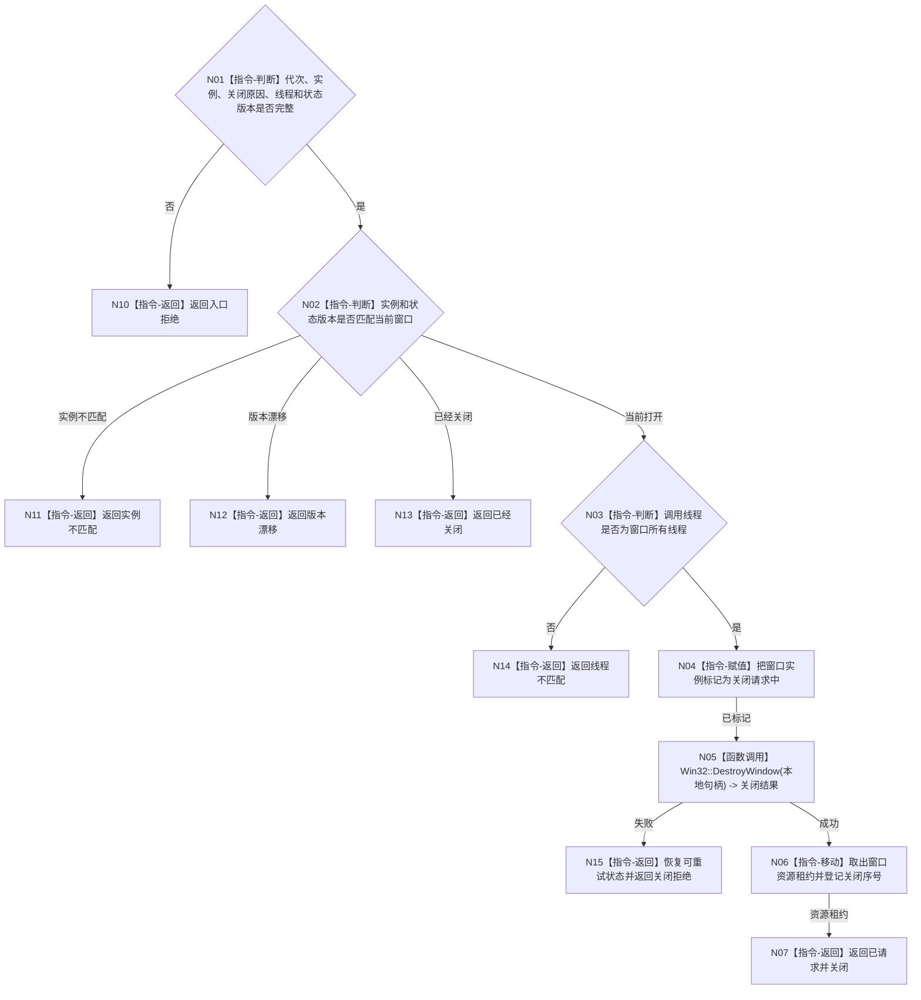

# BIZ-L3-005-06-01 请求控制面板窗口关闭目标函数流程图 v0.1

更新时间：2026-08-03

## 依据

```text
8110、8120；BIZ-L2-005-06
```

## 身份与边界

正式目标函数设计图。只对当前窗口实例发起幂等关闭并取得可释放资源租约；不停止程序宿主或其它线程。

## 函数合同

```text
根函数：控制面板窗口端口::请求窗口关闭
归属模块 / 文件 / 层级：控制面板窗口 / 海中鱼巣/界面/控制面板窗口.cpp / L3
现有或待新增：适配扩展；复用现有DestroyWindow路径，补实例、线程亲和和结构化资源租约
完整签名：控制面板窗口关闭请求结果 控制面板窗口端口::请求窗口关闭(const 控制面板窗口关闭动作请求& 请求)
参数：请求为只读借用；含运行代次、窗口实例稳定身份、关闭原因、当前控制面板线程身份和期望窗口状态版本
返回结果：值式结果；含已请求并关闭、已经关闭、实例不匹配、线程不匹配、版本漂移、关闭拒绝或内部错误，以及可选窗口资源租约和关闭序号
被调函数流程图：无；平台关闭和状态迁移均为本函数内指令
父图：BIZ-L2-005-06
```

## 流程图



## 节点合同

| 节点 | 类型 | 参数 / 输入绑定 | 结果 / 输出绑定 | 事实读写 | 后继条件 | 验证 |
| --- | --- | --- | --- | --- | --- | --- |
| N02/N03 | 指令 | 实例、版本和线程 | 关闭资格 | 只读窗口状态 | 当前实例且同线程 | 关闭竞争、错实例 |
| N04/N05 | 指令/函数调用 | 当前本地句柄 | 平台关闭结果 | UI副作用 | 成功或可重试失败 | 平台关闭失败 |
| N06/N07 | 指令 | 已关闭实例 | 独占资源租约 | 只写窗口状态 | 完成 | 租约唯一移动 |

## 关键边界

窗口关闭只说明当前UI实例结束；程序停止阶段和业务线程收口仍由程序宿主裁决。

