# BIZ-L3-005-06-02 逆序释放控制面板窗口资源组目标函数流程图 v0.2

更新时间：2026-08-27

## 依据

```text
8110 v0.3、8120 v0.10；BIZ-L2-005-06 v0.2
BIZ-L3-005-06-01 v0.2、BIZ-L4-005-01-01-03 v0.2
HEAD 1c13ace8：不存在控制面板窗口资源组或释放生产实现
```

## 身份与边界

正式目标职责图。该目标只消费一个呈现已结束窗口实例的唯一资源租约，按005-01创建完成位严格逆序释放全部窗口/内容适配资源。具体资源类型与释放函数由选定技术冻结，本图不列举页面、WebView、控件、菜单或平台句柄。

任一释放步骤未完成时，结果必须返还包含剩余完成位的唯一移动租约；调用方或窗口端口保存后以同一租约重试。只有全部完成位清空且租约不再拥有资源时才能返回已释放或合法零资源。

## 函数合同

```text
根目标：控制面板窗口端口::逆序释放窗口资源组
归属模块 / 文件 / 目标分解深度：控制面板窗口 / 具体文件待窗口与内容技术详细设计选择 / BIZ-L3
现有或待新增：待新增；职责已冻结，最终资源联合和释放ABI待详细设计
候选签名：控制面板窗口资源释放结果 控制面板窗口端口::逆序释放窗口资源组(控制面板窗口资源租约&& 租约) noexcept
参数最低职责：同实例唯一右值租约，含运行代次、窗口实例、呈现结束证明、资源完成位和适配端口资源拥有体
返回结果最低分类：已释放、合法零资源、入口拒绝、实例不匹配、资源失败、内部错误；全部未完成结果必须返还唯一剩余租约
被调函数流程图：无；完成位驱动的选定适配资源释放属于本函数内叶操作
父图：BIZ-L2-005-06 v0.2
施工门禁：资源完成位顺序、每项释放后置条件、无异常移动剩余租约和结果载荷已由005-01同一详细设计冻结
```

## 流程图

```mermaid
flowchart TD
    N01{"N01【指令-判断】唯一租约、实例、代次、呈现结束证明和资源完成位是否自洽"}
    N02{"N02【指令-判断】是否仍有已完成创建但未释放的最高逆序资源位"}
    N03["N03【指令-释放】调用选定适配合同释放当前最高逆序资源 -> 释放结果"]
    N04{"N04【指令-判断】释放后置条件是否成立"}
    N05["N05【指令-清空】只清空已证明释放完成的当前资源位"]
    N06{"N06【指令-判断】全部完成位是否清空且租约零资源"}
    N07["N07【指令-返回】消费空租约并返回已释放"]
    N08["N08【指令-返回】消费空租约并返回合法零资源"]
    N09["N09【指令-返回】返还原唯一租约并返回入口拒绝或实例不匹配"]
    N10["N10【指令-返回】返还含剩余完成位的唯一租约并返回资源失败"]
    N11["N11【指令-返回】返还可安全持有的唯一剩余租约并返回内部错误"]

    N01 -->|身份/实例/结束证明无效| N09
    N01 -->|完成位、拥有体或资源互相矛盾| N11
    N01 -->|自洽| N02
    N02 -->|无资源且从未完成创建| N08
    N02 -->|有最高逆序位| N03
    N02 -->|无资源但曾释放| N06
    N03 -->|资源失败或暂不可用| N10
    N03 -->|适配状态矛盾| N11
    N03 -->|报告已释放| N04
    N04 -->|否| N11
    N04 -->|是| N05 -->|下一位| N02
    N06 -->|是| N07
    N06 -->|否| N11
```



## 节点合同

| 节点 | 类型 | 参数 / 输入绑定 | 结果 / 输出绑定 | 事实读写 | 后继条件 | 验证 |
| --- | --- | --- | --- | --- | --- | --- |
| N01/N02 | 判断 | 唯一租约与完成位 | 准入、零资源或下一释放位 | 只读租约 | 分类完成 | 错实例、重复所有者、半完成位 |
| N03—N05 | 释放/判断/清空 | 当前最高逆序资源 | 释放结果与更新租约 | 释放UI资源 | 完成或返还剩余 | 部分初始化、暂不可用、后置条件失败 |
| N06—N11 | 判断/返回 | 更新后租约 | 成功或携带唯一剩余租约的非成功 | 消费空租约或返还剩余 | 终止 | 零资源泄漏、零双重释放、零所有权遗失 |

## 关键边界

- 逆序严格按005-01实际创建完成位，不按本图猜测具体资源类别；详细设计选择内容技术后一次冻结顺序。
- 未完成结果不得消费唯一租约。即使某些资源已成功释放，也必须在返还租约中清空对应完成位并保留全部剩余拥有体。
- 租约不完整、重复所有者、完成位与资源不一致属于内部错误；不能通过继续析构、清空句柄或进程退出伪装成已释放。
- 释放不等待日志、SQL、人读确认或业务线程，也不发布业务事实、线程完成见证或程序成功。
- “合法零资源”只适用于创建阶段确实没有形成任何资源；已经形成过但丢失拥有体不是零资源成功。

本图完成的是唯一租约逆序释放职责校正；具体资源联合和平台释放ABI尚未冻结。
