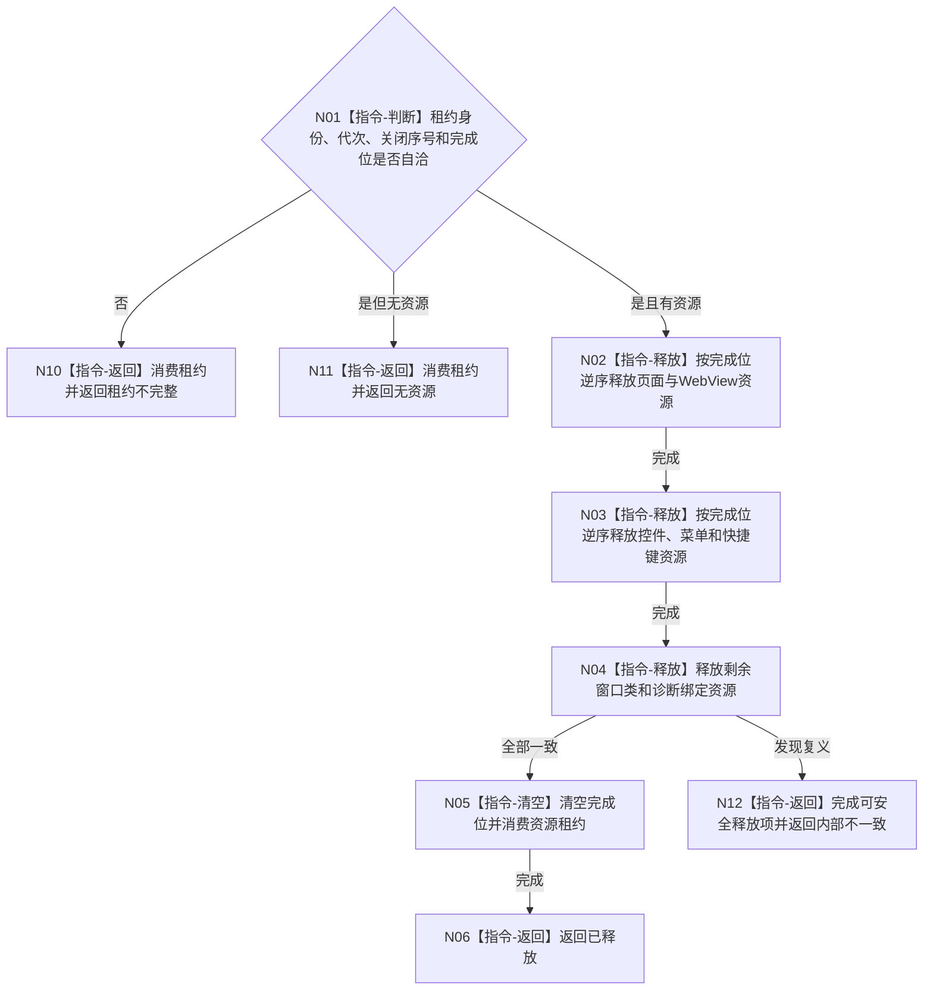

# BIZ-L3-005-06-02 释放控制面板窗口资源目标函数流程图 v0.1

更新时间：2026-08-03

## 依据

```text
8110、8120；BIZ-L2-005-06；BIZ-L3-005-06-01
```

## 身份与边界

正式目标函数设计图。按完成位逆序释放已关闭窗口实例的独占资源租约；异常只形成UI诊断结果。

## 函数合同

```text
根函数：控制面板窗口端口::释放窗口资源
归属模块 / 文件 / 层级：控制面板窗口 / 海中鱼巣/界面/控制面板窗口.cpp / L3
现有或待新增：适配扩展；把现有分散释放路径收束为完成位驱动的幂等租约消费
完整签名：控制面板窗口资源释放结果 控制面板窗口端口::释放窗口资源(控制面板窗口资源租约&& 租约) noexcept
参数：租约为独占右值；含窗口实例身份、运行代次、资源完成位、平台句柄组和关闭序号；调用后被消费
返回结果：值式结果；含已释放、无资源、租约不完整或内部不一致，以及窗口实例身份、已释放完成位和诊断项组
被调函数流程图：无；按完成位逆序释放均为本函数内指令
父图：BIZ-L2-005-06
```

## 流程图



## 节点合同

| 节点 | 类型 | 参数 / 输入绑定 | 结果 / 输出绑定 | 事实读写 | 后继条件 | 验证 |
| --- | --- | --- | --- | --- | --- | --- |
| N01 | 指令 | 独占资源租约 | 释放资格 | 只读租约 | 自洽、有资源或拒绝 | 重复消费、错实例 |
| N02—N04 | 指令 | 完成位和句柄组 | 释放诊断 | 释放UI资源 | 逆序推进 | 部分初始化、异常退出 |
| N05/N06 | 指令 | 已释放租约 | 结构化结果 | 清空本地状态 | 完成 | 幂等与无泄漏 |

## 关键边界

资源释放不得等待日志、SQL、页面确认或业务线程；失败只进入线程生命周期/诊断旁路，不反写业务事实。

