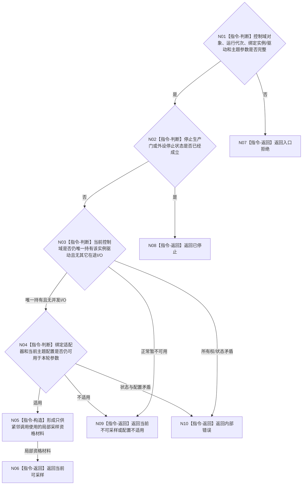

# BIZ-L3-006-01-01 复核外设控制权目标函数流程图 v0.2

更新时间：2026-08-28

## 依据

```text
6340 v0.6、6350 v0.6；BIZ-L2-006-01 v0.2
HEAD `4bb65c22`（D455采集器 blob `9009c0c8`）：D455帧来源对象内部持有采集状态、管线和停止门；采样一次只接收超时毫秒
```

## 身份与边界

正式目标职责图。本目标在每实例控制域内部核对“当前对象是否仍有资格进行一次I/O”。它不是对外签发控制权，不形成可缓存、可转授权或可跨调用复用的控制权见证。

## 函数合同

```text
根目标：外设采集端口::复核本控制域当前采样资格
归属模块 / 文件 / 目标分解深度：每实例外设控制域私有采集端口 / 具体文件待详细设计 / BIZ-L3
现有或待新增：通用职责待实现；D455采样一次内部已有停止、运行状态和管线存在性核对
候选签名：外设当前采样资格结果 外设采集端口::复核本控制域当前采样资格(const 外设主题采样参数& 参数) const noexcept
参数最低职责：本控制域对象已经持有的外设实例、驱动/适配器、运行代次、停止生产门和当前主题配置；调用参数只含本轮主题采样参数
返回结果最低分类：当前可采样、已停止、当前不可采样、配置不适用、入口拒绝、内部错误
成功载荷：只供紧邻适配器调用消费的局部资格材料；不得作为独立身份持久化或转授权
被调目标：无
父图：BIZ-L2-006-01 v0.2
```

## 流程图



## 节点合同

| 节点 | 类型 | 参数 / 输入绑定 | 结果 / 输出绑定 | 事实读写 | 验证 |
| --- | --- | --- | --- | --- | --- |
| N01—N04 | 本函数内指令 | 控制域对象和主题参数 | 当前、停止、暂不可用或矛盾 | 只读进程内控制状态 | 错代、停止、错实例、并发I/O、错配置 |
| N05 | 本函数内指令 | 已通过的当前对象状态 | 紧邻调用局部资格材料 | 无写入 | 不可缓存、不可转授权 |
| N06—N10 | 本函数内返回 | 复核分类 | 结构化结果 | 无写入 | 成功/非成功载荷互斥 |

## 关键边界

- 6340要求的是每实例独立控制域和串行控制，不要求为每次采样新建一份可外传控制凭证。
- 等待项和订阅项只参与报告调度、任务匹配与承接；它们不是采样控制权。可选控制命令只有在其确实触发本次采样时才作为来源材料保留。
- 共享线程池只共享执行资源，不共享外设实例、驱动句柄、状态机或当前I/O资格。
- 资格复核成功只允许紧邻调用已经绑定的适配器，不授权任务承接、报告发布、世界事实提交或业务结算。

本图冻结职责，不冻结公开DTO或可施工ABI。
