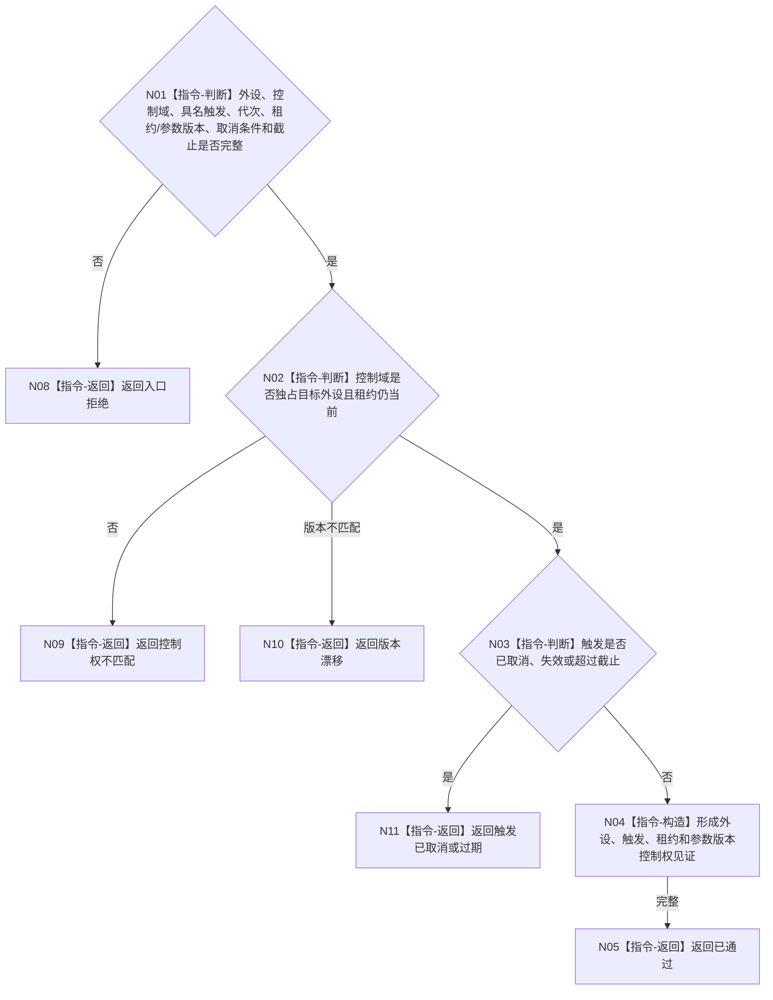

# BIZ-L3-006-01-01 复核外设控制权目标函数流程图 v0.2

更新时间：2026-08-27

## 依据

```text
6340 v0.6；BIZ-L2-006-01 v0.2
```

## 身份与边界

正式目标函数设计图。纯值复核一个具名命令、等待项或订阅项触发是否属于目标外设实例的当前独立控制域；共享线程池不放宽控制权。控制域资格来自创建者交付的唯一实例/驱动租约和当前版本，不从线程号或缓存认领。

## 函数合同

```text
根函数：复核外设控制权
归属模块 / 文件 / 层级：外设控制协议 / 海中鱼巣/适配/协议.外设控制.ixx / L3
现有或待新增：待新增通用纯值函数；具体驱动私有控制状态不得进入通用ABI
完整签名：外设控制权复核结果 复核外设控制权(const 外设控制权复核请求& 请求) noexcept
参数：请求为只读借用；含外设身份、控制域身份、具名触发（命令/等待项/订阅项之一）、运行代次、唯一实例/驱动租约版本、采集参数版本、取消条件和截止时间
返回结果：值式结果；含已通过、控制权不匹配、触发已取消或过期、版本漂移、入口拒绝或内部不一致，以及只约束本次I/O的控制权见证
被调函数流程图：无；身份、租约、版本和截止复核均为本函数内指令
父图：BIZ-L2-006-01
```

## 流程图



## 节点合同

| 节点 | 类型 | 参数 / 输入绑定 | 结果 / 输出绑定 | 事实读写 | 后继条件 | 验证 |
| --- | --- | --- | --- | --- | --- | --- |
| N01—N03 | 指令 | 控制请求 | 控制资格 | 无写入 | 通过或具名拒绝 | 多任务竞争、共享池、过期 |
| N04/N05 | 指令 | 合法身份和版本 | 控制权见证 | 无写入 | 完成 | 见证不可转授权 |

## 关键边界

控制权见证只授权本轮外设I/O，不授权任务承接、世界事实提交或业务结算；报告命令可空时仍必须保留等待项或订阅项触发。
