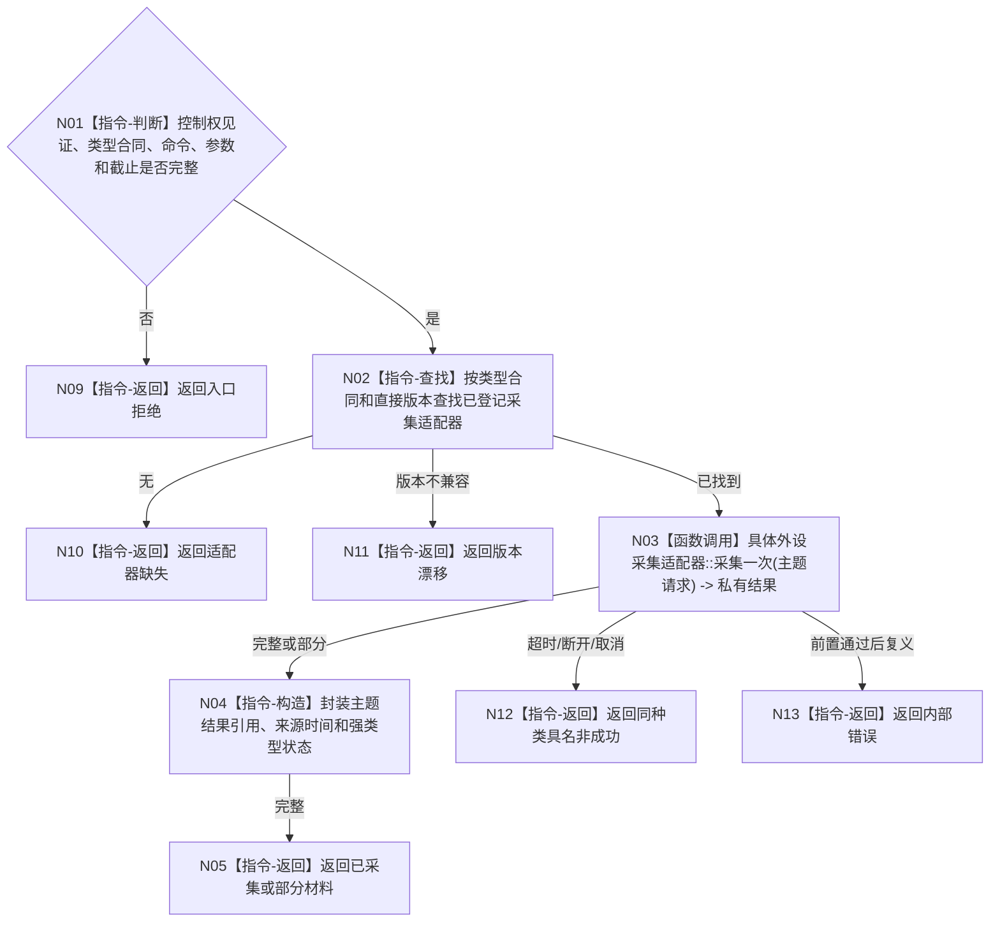

# BIZ-L3-006-01-02 调用具体外设采集适配器目标函数流程图 v0.1

更新时间：2026-08-03

## 依据

```text
6340、6350；BIZ-L2-006-01
当前能力候选：采集器.D455相机.ixx
```

## 身份与边界

正式目标函数设计图。按已登记外设主题调用当前实例适配器，保留超时、断开、取消和部分材料；不把私有类型泄漏为通用报告。

## 函数合同

```text
根函数：外设主题采集路由::调用具体外设采集适配器
归属模块 / 文件 / 层级：外设主题采集路由 / 海中鱼巣/适配/路由.外设主题采集.ixx / L3
现有或待新增：待新增路由；D455采集器仅作一个主题适配候选
完整签名：外设主题采集结果 外设主题采集路由::调用具体外设采集适配器(const 外设主题采集请求& 请求)
参数：请求为只读借用；含控制权见证、外设类型合同、命令、采集参数、截止和取消令牌只读视图
返回结果：值式结果；含已采集、部分材料、超时、断开、取消、适配器缺失、版本漂移或内部错误，以及主题私有采集结果引用
被调函数流程图：BIZ-L4-006-01-02-01 双目相机采集适配器采集一次；其它外设主题在正式登记后新增对应L4
父图：BIZ-L2-006-01
```

## 流程图



## 节点合同

| 节点 | 类型 | 参数 / 输入绑定 | 结果 / 输出绑定 | 事实读写 | 后继条件 | 验证 |
| --- | --- | --- | --- | --- | --- | --- |
| N02 | 指令 | 类型合同版本 | 适配器引用 | 只读注册表 | 找到、缺失、漂移 | 无名称猜测 |
| N03 | 函数调用 | 主题请求 | 私有采集结果 | 外设I/O | 具名状态 | 超时、断连、取消、部分帧 |
| N04/N05 | 指令 | 私有结果 | 通用路由结果 | 只形成材料 | 完成 | 私有DTO不外泄 |

## 关键边界

路由只选择外设适配器；采集成功不等于报告成熟、任务命中或世界事实成立。
