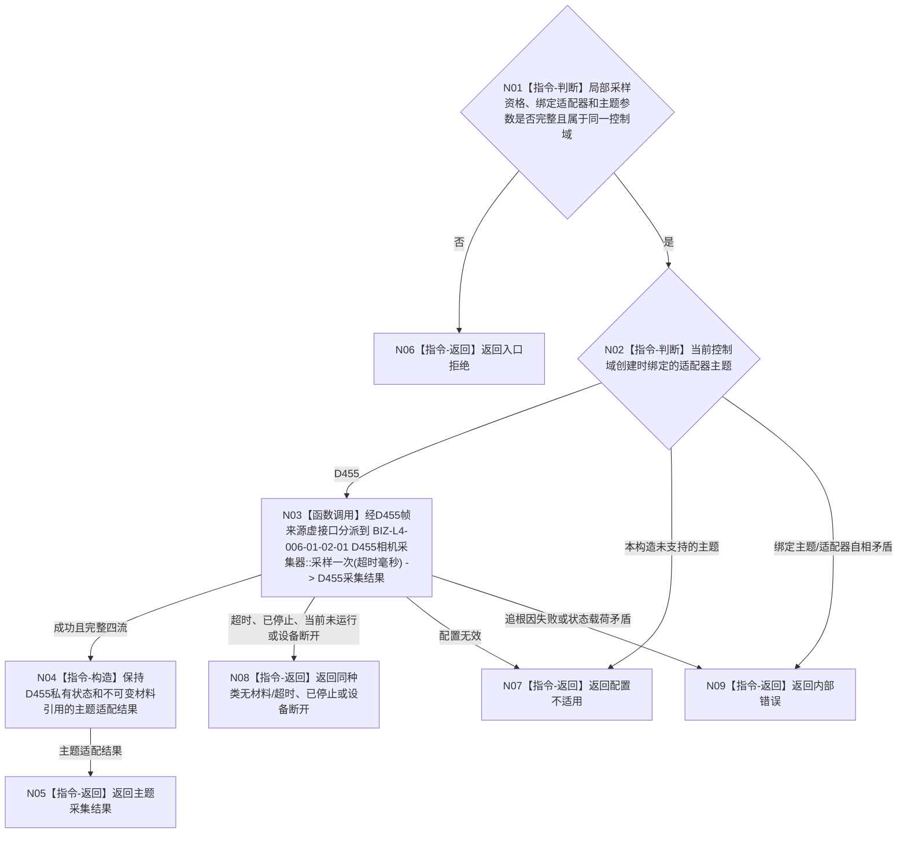

# BIZ-L3-006-01-02 调用具体外设采集适配器目标函数流程图 v0.2

更新时间：2026-08-28

## 依据

```text
6340 v0.6、6350 v0.6；BIZ-L2-006-01 v0.2
HEAD `4bb65c22`（D455协议 blob `f110508f`、采集器 blob `9009c0c8`）：公开虚接口`D455帧来源::采样一次(std::uint32_t 超时毫秒)`由`D455相机采集器::采样一次`覆盖
```

## 身份与边界

正式目标职责图。当前控制域直接调用创建时已经绑定的主题采集适配器，不在每次采样时按名称、类型码或版本号从运行时注册表发现适配器。

## 函数合同

```text
根目标：外设采集端口::调用已绑定外设采集适配器
归属模块 / 文件 / 目标分解深度：每实例外设控制域的主题适配边界 / 具体文件待详细设计 / BIZ-L3
现有或待新增：通用适配边界待新增；D455帧来源是当前唯一具名采集叶
候选签名：外设主题采集结果 外设采集端口::调用已绑定外设采集适配器(const 外设主题采样参数& 参数)
参数最低职责：紧邻复核形成的局部采样资格、创建时绑定的适配器引用和本轮主题参数
返回结果最低分类：完整材料、主题合同允许的部分材料、无材料/超时、已停止、设备断开、配置不适用、资源失败、内部错误
成功载荷：适配器拥有的主题私有不可变材料引用及其原生来源字段；通用边界不重解释私有负载
被调目标：BIZ-L4-006-01-02-01 D455相机采集器::采样一次；当前控制域经D455帧来源虚接口分派到该覆盖实现；其它主题须先有自己的正式适配合同再增加叶
父图：BIZ-L2-006-01 v0.2
```

## 流程图



## 节点合同

| 节点 | 类型 | 参数 / 输入绑定 | 结果 / 输出绑定 | 事实读写 | 验证 |
| --- | --- | --- | --- | --- | --- |
| N01/N02 | 本函数内指令 | 局部资格、绑定适配器和主题参数 | 适配器调用分支 | 只读控制域构造绑定 | 错控制域、错主题、缺适配器 |
| N03 | 函数调用 | 超时毫秒 -> D455帧来源参数 | D455采集结果 | 真实外设I/O | 完整、超时、停止、断开、追根因失败 |
| N04 | 本函数内指令 | D455私有结果 | 保持原状态和引用的主题结果 | 只形成运行期材料 | 私有DTO不泄漏为通用报告 |
| N05—N09 | 本函数内返回 | 主题结果分类 | 结构化结果 | 无业务事实写入 | 状态/载荷互斥 |

## 关键边界

- 6340的“每种外设独立控制线程或代理”不等于建立全局适配器注册表。适配器选择属于控制域创建配置，采样阶段只调用已绑定对象。
- D455当前成功形状只有同步彩色、深度、左右红外、标定/配置和采集元数据完整；没有部分成功，也没有取消令牌参数。
- 适配层只保持主题私有结果，不形成6350四类报告产品、成熟度、质量结论或任务材料。
- 若后续支持其它外设主题，应增加对应BIZ-L4叶并在控制域创建合同中冻结绑定，不得由本函数运行时猜测。

本图不证明通用端口、T06生产构造或适配器装配已经实现。
