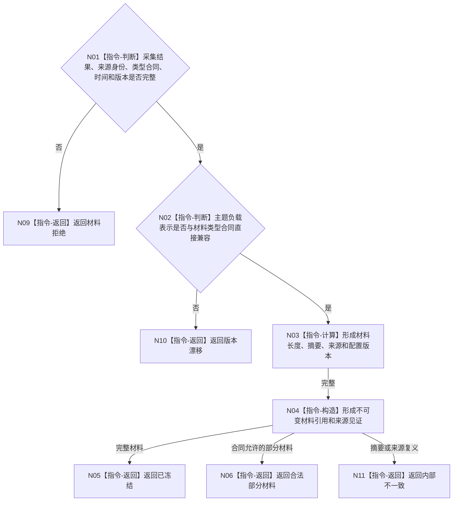

# BIZ-L3-006-01-03 冻结外设原始材料引用目标函数流程图 v0.1

更新时间：2026-08-03

## 依据

```text
4020、6340、6350；BIZ-L2-006-01
```

## 身份与边界

正式目标函数设计图。把主题采集结果冻结为不可变原始材料引用和来源摘要；材料文件、缓存和引用都不是世界事实。

## 函数合同

```text
根函数：冻结外设原始材料引用
归属模块 / 文件 / 层级：外设原始材料协议 / 海中鱼巣/适配/协议.外设原始材料.ixx / L3
现有或待新增：待新增通用纯值边界；具体主题负载继续由主题协议拥有
完整签名：外设原始材料冻结结果 冻结外设原始材料引用(const 外设原始材料冻结请求& 请求)
参数：请求为只读借用；含主题采集结果、外设/命令身份、材料类型合同、发生时间、配置/参数版本和原始质量量
返回结果：值式结果；含已冻结、合法部分材料、材料拒绝、版本漂移或内部不一致，以及不可变材料引用、摘要和来源见证
被调函数流程图：无；引用、摘要和来源合同复核均为本函数内指令
父图：BIZ-L2-006-01
```

## 流程图



## 节点合同

| 节点 | 类型 | 参数 / 输入绑定 | 结果 / 输出绑定 | 事实读写 | 后继条件 | 验证 |
| --- | --- | --- | --- | --- | --- | --- |
| N01/N02 | 指令 | 采集结果和合同 | 冻结资格 | 无业务写入 | 兼容或拒绝 | 私有类型、错版本 |
| N03/N04 | 指令 | 合法负载 | 材料引用和见证 | 只形成材料 | 完整或部分 | 摘要、来源、时间 |
| N05/N06 | 返回 | 冻结材料 | 结构化状态 | 无业务写入 | 终止 | 部分材料不伪装完整 |

## 关键边界

冻结只保证材料可回查和不可变，不证明观察质量、报告产品资格或业务事实。
