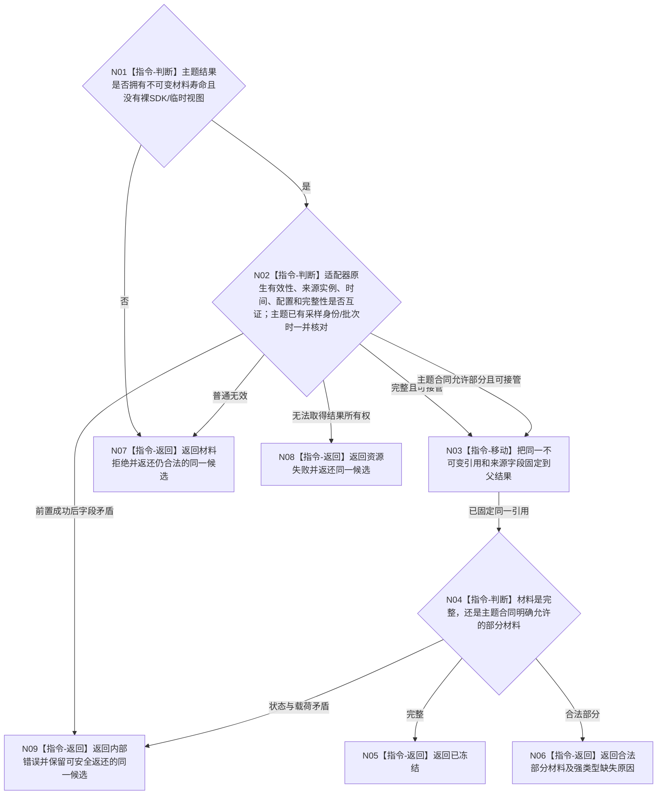

# BIZ-L3-006-01-03 冻结外设原始材料引用目标函数流程图 v0.2

更新时间：2026-08-28

## 依据

```text
4020、6340 v0.6、6350 v0.6；BIZ-L2-006-01 v0.2
发布源码证据基线 `472914a8`（D455协议 blob `f110508f`）：D455采集结果已经以shared_ptr<const D455同步帧材料>拥有不可变材料寿命
```

## 身份与边界

正式目标职责图。本目标把同一次适配结果已经拥有的不可变材料引用、来源字段和完整性状态固定到父函数结果，随后由T06唯一在途槽接管。它不复制原始字节、不另建材料身份，也不把运行期引用升级为4020独立材料文件、类型化值或世界事实。

## 函数合同

```text
根目标：外设采集端口::冻结外设原始材料引用
归属模块 / 文件 / 目标分解深度：每实例外设控制域的材料适配边界 / 具体文件待详细设计 / BIZ-L3
现有或待新增：通用适配职责待新增；D455采集结果已提供不可变共享引用和材料有效性函数
候选签名：外设原始材料冻结结果 外设采集端口::冻结外设原始材料引用(外设主题采集结果 结果)
参数最低职责：按值移动或唯一接管同一主题采集结果；不接受裸SDK缓冲区、线程局部地址或缓存位置作为材料
返回结果最低分类：已冻结、主题合同允许的部分材料、材料拒绝、资源失败、内部错误
成功载荷：同一不可变引用及适配器已经形成的来源实例、发生时间、配置和完整性材料；主题已有采样身份/批次时原样保留
非成功所有权：仍存在合法候选时必须随结果返还给父函数唯一在途槽，不能只返回原因后丢失材料
被调目标：无
父图：BIZ-L2-006-01 v0.2
```

## 流程图



## 节点合同

| 节点 | 类型 | 参数 / 输入绑定 | 结果 / 输出绑定 | 事实读写 | 验证 |
| --- | --- | --- | --- | --- | --- |
| N01/N02 | 本函数内指令 | 主题采集结果 | 所有权、来源和完整性分类 | 只读材料 | 裸SDK视图、错来源、错时间、错配置、状态矛盾 |
| N03/N04 | 本函数内指令 | 同一不可变引用 | 父结果中的完整/部分材料 | 只移动运行期所有权 | 零字节复制、零第二材料身份 |
| N05—N09 | 本函数内返回 | 冻结分类和同一候选 | 成功或具名非成功 | 无业务事实写入 | 失败候选所有权守恒 |

## 关键边界

- D455的`shared_ptr<const D455同步帧材料>`已经提供不可变共享寿命；本目标只能移动/保持该引用，不再复制四流字节来制造第二材料。
- 4020独立材料文件要求格式、长度、摘要、来源、类型校验和正式值事实引用；本运行期步骤没有取得该owner写权，也不提前形成文件或类型化值。
- 摘要和报告身份只在后续报告形成/发布合同明确要求时形成。本目标不得为通用外设凭空规定统一摘要算法。
- 冻结失败不得重新采样；仍有合法候选必须进入T06唯一在途槽收束或返还，不能依赖析构、日志或缓存位置保底。

本图只冻结运行期材料所有权守恒，不证明跨重启恢复或正式报告发布。
