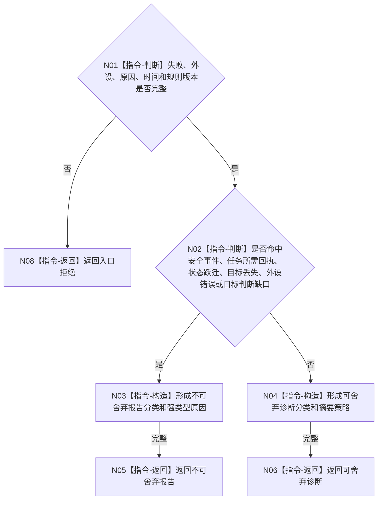

# BIZ-L3-006-02-01 分类外设失败目标函数流程图 v0.1

更新时间：2026-08-03

## 依据

```text
6340；BIZ-L2-006-02
```

## 身份与边界

正式目标函数设计图。纯值裁决外设失败是可舍弃诊断还是不可静默舍弃报告；不创建任务、需求或事实。

## 函数合同

```text
根函数：分类外设失败
归属模块 / 文件 / 层级：外设失败分类 / 海中鱼巣/适配/算法.外设失败分类.ixx / L3
现有或待新增：待新增纯值算法
完整签名：外设失败分类结果 分类外设失败(const 外设失败分类请求& 请求) noexcept
参数：请求为只读借用；含失败身份、外设身份、原因类型、发生时间、当前任务回执/安全/状态跃迁/目标丢失/目标判断影响标记和规则版本
返回结果：值式结果；含可舍弃诊断、不可舍弃报告、入口拒绝、版本漂移或内部不一致，以及强类型分类原因
被调函数流程图：无；6340类别矩阵复核为本函数内指令
父图：BIZ-L2-006-02
```

## 流程图



## 节点合同

| 节点 | 类型 | 参数 / 输入绑定 | 结果 / 输出绑定 | 事实读写 | 后继条件 | 验证 |
| --- | --- | --- | --- | --- | --- | --- |
| N01/N02 | 指令 | 失败事实材料 | 分类资格 | 无写入 | 两类互斥结果 | 六类不可舍弃矩阵 |
| N03—N06 | 指令 | 分类依据 | 分类结果 | 无写入 | 完成 | 文本不参与分类 |

## 关键边界

分类决定传递可靠性，不决定任务失败、外设修复、需求生成或世界事实。
