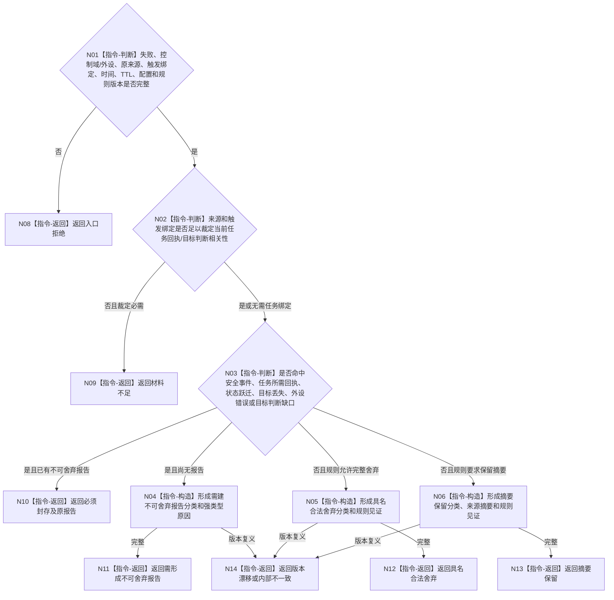

# BIZ-L3-006-02-01 分类外设失败目标函数流程图 v0.2

更新时间：2026-08-27

## 依据

```text
6340 v0.6；BIZ-L2-006-02 v0.2
```

## 身份与边界

正式目标函数设计图。纯值裁决外设非成功材料应具名舍弃、保留摘要、形成不可静默舍弃报告，还是封存既有不可舍弃报告；不创建任务、需求或事实。

## 函数合同

```text
根函数：分类外设失败
归属模块 / 文件 / 层级：外设失败分类 / 海中鱼巣/适配/算法.外设失败分类.ixx / L3
现有或待新增：待新增纯值算法
完整签名：外设失败分类结果 分类外设失败(const 外设失败分类请求& 请求) noexcept
参数：请求为只读借用；含失败身份、控制域/外设身份、原始结果或原报告、具名命令/等待项/订阅项及其任务/工作项绑定、发生/评估时间、TTL、配置版本和舍弃规则版本；不得由调用方传入“当前任务所需”“影响目标判断”等裸布尔结论
返回结果：值式结果；含具名合法舍弃、摘要保留、需形成不可舍弃报告、既有不可舍弃报告必须封存、材料不足、入口拒绝、版本漂移或内部不一致，以及逐字段可回查的强类型分类原因
被调函数流程图：无；6340类别矩阵复核为本函数内指令
父图：BIZ-L2-006-02
```

## 流程图



## 节点合同

| 节点 | 类型 | 参数 / 输入绑定 | 结果 / 输出绑定 | 事实读写 | 后继条件 | 验证 |
| --- | --- | --- | --- | --- | --- | --- |
| N01—N03 | 指令 | 原始非成功、原报告和正式触发绑定 | 分类资格 | 无写入 | 四类互斥结果 | 六类不可舍弃矩阵、普通超时、无命中、过期、摘要策略 |
| N04—N14 | 指令 | 分类依据与规则版本 | 分类结果 | 无写入 | 完成 | 文本和调用方裸布尔不参与分类 |

## 关键边界

分类决定传递可靠性，不决定任务失败、外设修复、需求生成或世界事实。采集超时、断开和质量不足不自动等于线程故障；只有真实线程状态变化才由006-05另行报告。
