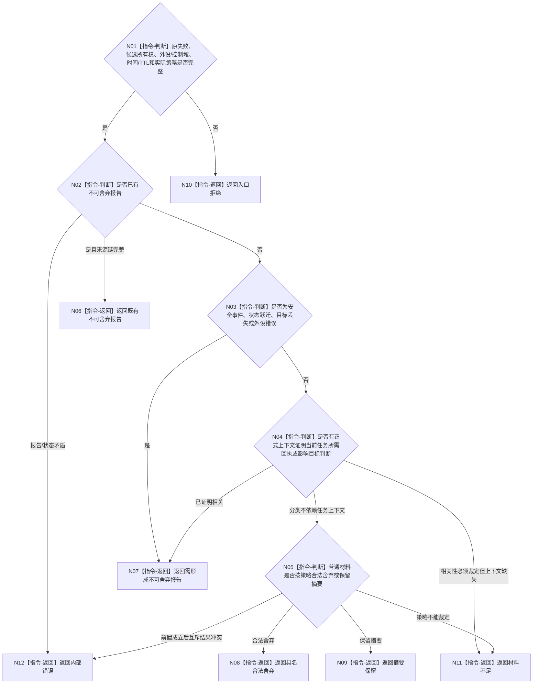

# BIZ-L3-006-02-01 分类外设失败目标函数流程图 v0.2

更新时间：2026-08-27

## 依据

```text
4050、6340 v0.6；BIZ-L2-006-02 v0.2
```

## 身份与边界

正式目标职责图。纯值判断同一外设非成功材料应合法舍弃、保留摘要、形成不可舍弃报告，还是保持既有不可舍弃报告。它不把采样超时解释为线程故障，也不把等待项/订阅项解释成每帧触发许可。

## 函数合同

```text
根目标：分类外设失败
归属模块 / 文件 / 目标分解深度：外设控制域私有纯值算法 / 具体文件待详细设计 / BIZ-L3
现有或待新增：待新增；职责已冻结，字段顺序、状态数值和策略版本ABI未冻结
候选签名：外设失败分类结果 分类外设失败(const 外设失败分类请求& 请求) noexcept
参数最低职责：同一原始结果/原报告和材料所有权、外设/控制域、时间/TTL、实际适用的强类型策略；可选正式报告生产/任务上下文不得由调用方布尔替代
返回结果最低分类：具名合法舍弃、摘要保留、需形成不可舍弃报告、既有不可舍弃报告、材料不足、入口拒绝、内部错误
被调目标：无
父图：BIZ-L2-006-02 v0.2
```

## 流程图



## 节点合同

| 节点 | 类型 | 输入绑定 | 输出绑定 | 事实读写 | 验证 |
| --- | --- | --- | --- | --- | --- |
| N01—N05 | 本函数内指令 | 原失败、所有权、正式上下文和策略 | 分类资格 | 无写入 | 内在不可舍弃、上下文相关、普通策略三类分账 |
| N06—N12 | 本函数内返回 | 分类依据 | 互斥强类型结果 | 无写入 | 文本、线程状态猜测和调用方裸布尔不参与 |

## 关键边界

分类只决定传递和收束方式，不决定外设修复、任务失败、需求生成或世界事实。设备断开是外设错误材料；是否同时发生线程生命周期故障必须由006-05依据真实物理线程事件另行判断。
