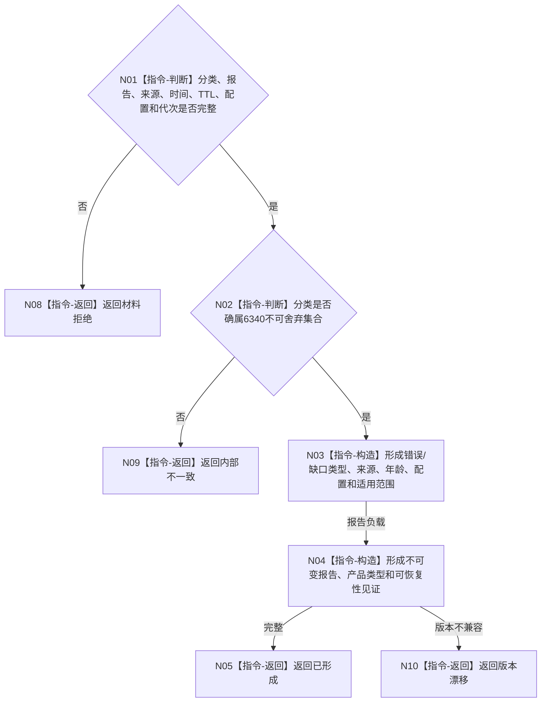

# BIZ-L3-006-02-02 构造强类型外设错误或缺口报告目标函数流程图 v0.1

更新时间：2026-08-03

## 依据

```text
6340；BIZ-L2-006-02、BIZ-L2-006-04
```

## 身份与边界

正式目标函数设计图。把不可舍弃分类转换为可恢复的强类型错误或缺口报告；仍只是待任务域承接的材料。

## 函数合同

```text
根函数：构造强类型外设错误或缺口报告
归属模块 / 文件 / 层级：外设报告协议 / 海中鱼巣/适配/协议.外设报告.ixx / L3
现有或待新增：待新增通用纯值形成器
完整签名：外设错误缺口报告形成结果 构造强类型外设错误或缺口报告(const 外设错误缺口报告形成请求& 请求) noexcept
参数：请求为只读借用；含不可舍弃分类、报告身份、外设/命令身份、来源材料引用、发生时间、TTL、配置版本和生产代次
返回结果：值式结果；含已形成、材料拒绝、版本漂移或内部不一致，以及不可变外设报告和可恢复性见证
被调函数流程图：无；报告字段和可恢复材料构造均为本函数内指令
父图：BIZ-L2-006-02
```

## 流程图



## 节点合同

| 节点 | 类型 | 参数 / 输入绑定 | 结果 / 输出绑定 | 事实读写 | 后继条件 | 验证 |
| --- | --- | --- | --- | --- | --- | --- |
| N01/N02 | 指令 | 分类与来源 | 形成资格 | 无写入 | 合法不可舍弃 | 错分类、空来源 |
| N03/N04 | 指令 | 合法材料 | 不可变报告 | 只形成材料 | 完整或漂移 | TTL、配置、恢复字段 |
| N05 | 返回 | 报告和见证 | 已形成 | 无写入 | 终止 | 不生成业务结论 |

## 关键边界

错误报告进入队列后仍须由任务域一次承接；不得因“不可舍弃”直接写任务、需求、世界或价值事实。

