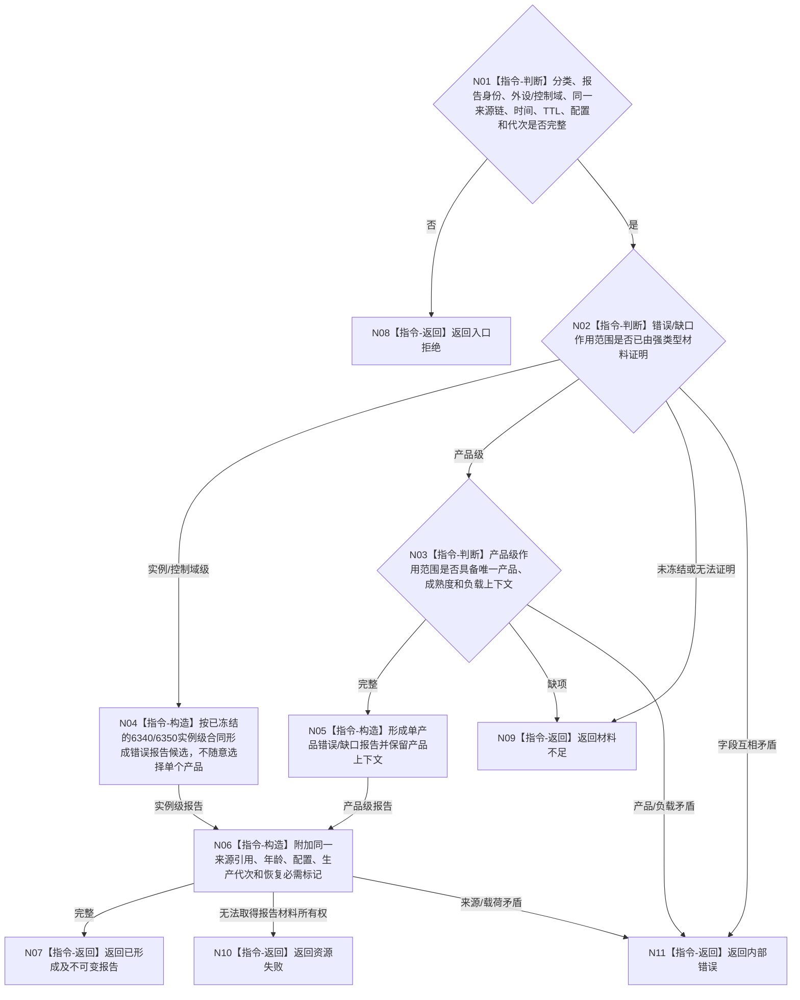

# BIZ-L3-006-02-02 构造强类型外设错误或缺口报告目标函数流程图 v0.2

更新时间：2026-08-27

## 依据

```text
4050、6340 v0.6、6350 v0.6；BIZ-L2-006-02 v0.2、BIZ-L2-006-04 v0.2
```

## 身份与边界

正式目标职责图。把不可舍弃分类和同一来源链变成待006-04保存/发布的强类型外设错误或缺口报告。纯构造不证明报告已持久、已入队、已承接或已成为世界事实。

## 函数合同

```text
根目标：构造强类型外设错误或缺口报告
归属模块 / 文件 / 目标分解深度：外设报告值式协议 / 具体文件待详细设计 / BIZ-L3
现有或待新增：待新增；职责已冻结，报告作用范围ABI未冻结
候选签名：外设错误缺口报告形成结果 构造强类型外设错误或缺口报告(const 外设错误缺口报告形成请求& 请求) noexcept
参数最低职责：不可舍弃分类、唯一报告身份、外设/控制域、同一原结果/材料/报告引用、发生时间、TTL、配置和生产代次；可选命令/生产/任务上下文只在真实存在时原样保留
结果最低分类：已形成、材料不足、入口拒绝、资源失败、内部错误；成功携带同一来源链的不可变强类型报告
待冻结机器合同：报告作用范围必须区分外设实例/控制域级错误与单个6350产品级错误；6340/6350须明确实例级报告怎样合法承载现行必填产品/成熟度，禁止执行者随意选择一个产品
被调目标：无
父图：BIZ-L2-006-02 v0.2
```

## 流程图



## 节点合同

| 节点 | 类型 | 输入绑定 | 输出绑定 | 事实读写 | 验证 |
| --- | --- | --- | --- | --- | --- |
| N01—N03 | 本函数内指令 | 分类和同一来源链 | 实例级/产品级形成资格 | 无写入 | 空来源、错作用范围、产品缺项/复义 |
| N04—N06 | 本函数内指令 | 合法分类材料 | 报告候选或不可变报告 | 只形成运行期材料 | 实例级零伪产品、产品级上下文完整、所有权守恒 |
| N07—N11 | 本函数内返回 | 报告形成分类 | 结构化结果 | 无业务事实写入 | 成功/非成功载荷互斥 |

## 关键边界

- 6340要求不可舍弃外设错误进入正式报告链，但6350四类逻辑产品只描述相机供给产品；两者不能通过给设备级错误随意指定一个产品来拼接。
- 作用范围与产品承载机器语义未冻结前，本图不是可施工ABI。必须先修订/闭合6340、6350，再由详细设计落字段，不能由执行者临场选可空字段或特殊产品值。
- 报告形成后仍须由006-04的恢复owner保存/读回并进入唯一物理报告队列；本目标不拥有队列或持久权威。
