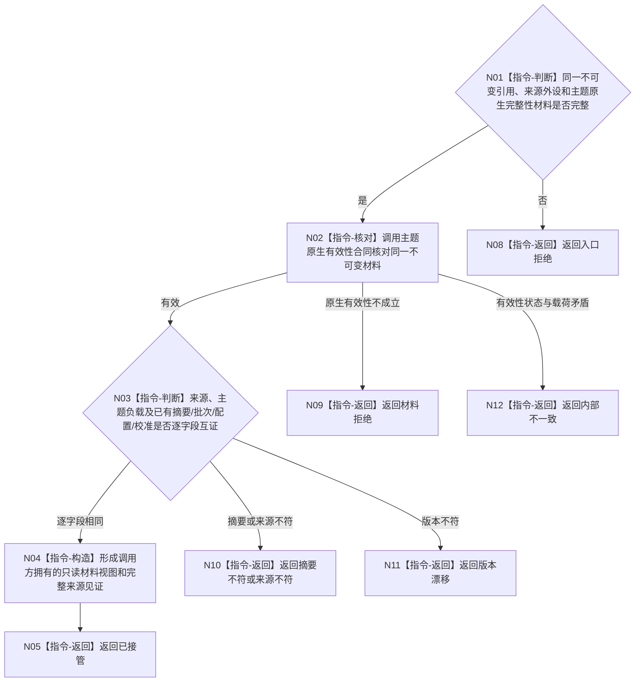

# BIZ-L3-006-03-01 核对并接管外设原始材料目标函数流程图 v0.2

更新时间：2026-08-28

## 依据

```text
4020、6340 v0.6、6350 v0.6；BIZ-L2-006-03 v0.2
HEAD `4bb65c22`（D455协议 blob `f110508f`）：006-01已冻结保持适配器原不可变引用；D455采集结果直接携带shared_ptr<const D455同步帧材料>
```

## 身份与边界

正式目标职责图。核对并接管006-01交付的同一不可变原始材料引用；直接拥有引用时不得强制绕行缓存、路径或第二读取服务。主题已有摘要、批次、配置或校准字段时原样互证，不补造通用摘要或采集触发。

## 函数合同

```text
根目标：核对并接管外设原始材料
归属模块 / 文件 / 目标分解深度：控制域私有材料边界 / 具体文件待详细设计 / BIZ-L3
现有或待新增：通用职责待新增；D455可直接复用不可变共享引用与D455同步帧材料有效
候选签名：外设原始材料接管结果 核对并接管外设原始材料(外设原始材料引用 引用) noexcept
参数最低职责：按值移动或只读借用006-01同一不可变引用、来源外设和主题原生完整性材料；主题已有摘要/批次/配置/校准时原样保留
返回结果：值式结果；含已接管、材料拒绝、摘要不符、来源不符、版本漂移、入口拒绝或内部不一致，以及不可变材料视图和完整来源见证
被调函数流程图：无；定位、摘要、来源和版本核对均为本函数内指令
父图：BIZ-L2-006-03 v0.2
```

## 流程图



## 节点合同

| 节点 | 类型 | 参数 / 输入绑定 | 结果 / 输出绑定 | 事实读写 | 后继条件 | 验证 |
| --- | --- | --- | --- | --- | --- | --- |
| N02/N03 | 核对/判断 | 冻结引用和完整预期字段 | 同一不可变材料或具名非成功 | 只读进程内受控材料 | 全字段互证后继续 | 无效、篡改、错外设、错触发、错配置 |
| N04/N05 | 构造/返回 | 已互证材料 | 值式视图和来源见证 | 无业务写入 | 成功 | 不泄漏可写引用；不重新采样 |

## 当前代码对照

- D455采集结果已经直接拥有不可变共享材料；本步骤只调用主题原生有效性合同并接管同一引用，不存在按身份“未找到”的第二读取，也不要求先写入`D455帧材料缓存`。
- D455缓存和上行桥可以服务后续进程内发布，但不是006-03读取同一在途材料的必经第二权威。

## 关键边界

材料可读只证明取得同一来源材料，不等于时间已对齐、四类产品已形成、质量合格、报告可发布或世界事实成立。
