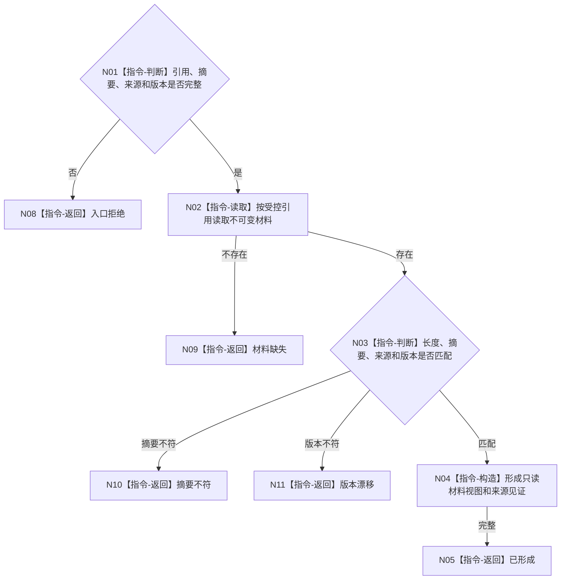

# BIZ-L3-006-03-01 读取外设原始材料目标函数流程图 v0.1

更新时间：2026-08-03

## 依据

```text
4020、6340、6350；BIZ-L2-006-03
```

## 身份与边界

正式目标函数设计图。校验引用、摘要、来源和版本后读取不可变外设原始材料；不从路径、缓存或SQL补造材料。

## 函数合同

```text
根函数：外设原始材料服务::读取外设原始材料
归属模块 / 文件 / 层级：外设原始材料读取 / 海中鱼巣/适配/服务.外设原始材料.ixx / L3
现有或待新增：待新增通用读取入口
完整签名：外设原始材料读取结果 外设原始材料服务::读取外设原始材料(const 外设原始材料读取请求& 请求) const
参数：请求为只读借用；含材料引用、预期摘要、来源外设/命令、类型合同版本和配置版本
返回结果：调用方拥有的不可变值式结果；含已形成、材料缺失、摘要不符、版本漂移、入口拒绝或内部不一致，以及受控原始材料视图和来源见证
被调函数流程图：无；定位、摘要和来源核对均为本函数内指令
父图：BIZ-L2-006-03
```

## 流程图



## 节点合同

| 节点 | 类型 | 参数 / 输入绑定 | 结果 / 输出绑定 | 事实读写 | 后继条件 | 验证 |
| --- | --- | --- | --- | --- | --- | --- |
| N02/N03 | 指令 | 受控引用 | 校验材料 | 只读独立材料 | 匹配或具名拒绝 | 缺失、篡改、错来源 |
| N04/N05 | 指令 | 合法材料 | 值式只读视图 | 无写入 | 完成 | 生命周期不泄漏可写引用 |

## 关键边界

材料可读不等于质量合格、报告成熟或业务事实成立。

