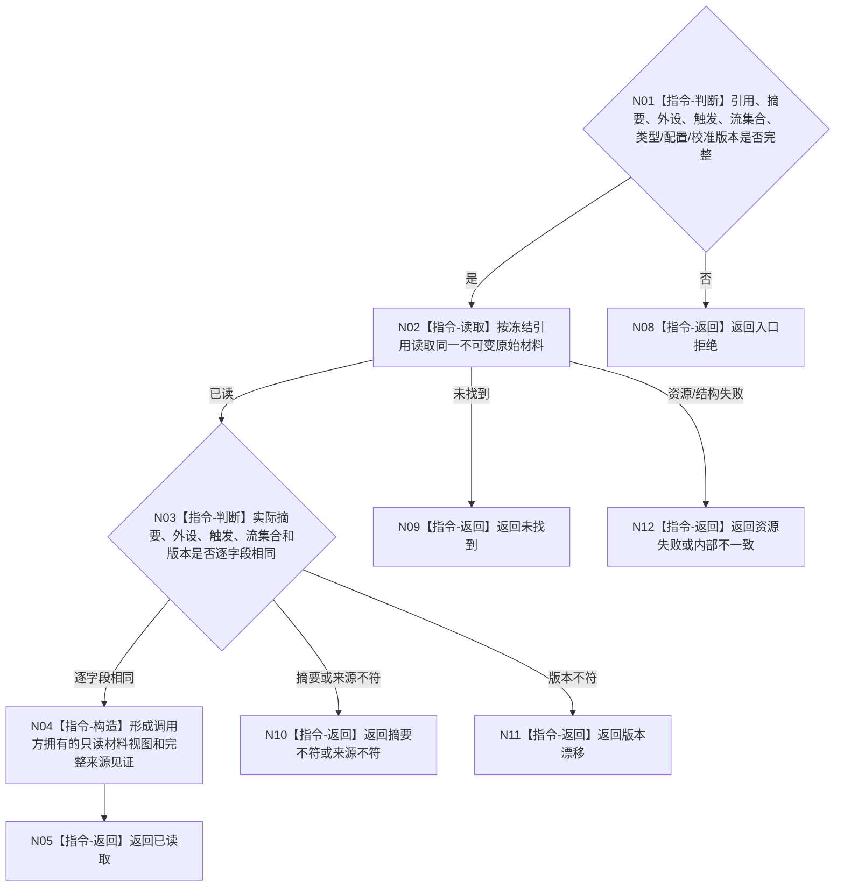

# BIZ-L3-006-03-01 读取外设原始材料目标函数流程图 v0.2

更新时间：2026-08-27

## 依据

```text
4020、6340 v0.6、6350 v0.6；BIZ-L2-006-03 v0.2
HEAD 05b086e7：协议.D455采样材料.ixx、缓存.D455帧材料.ixx
```

## 身份与边界

正式目标函数设计图。按冻结引用读取同一份不可变外设原始材料，逐字段互证来源外设、采集触发、配置、校准、流集合和摘要；不从当前缓存位置、路径、SQL、旧消息或重新采样补造材料。D455候选缓存是当前可复用的进程内承载，不是跨重启材料权威。

## 函数合同

```text
根函数：外设原始材料服务::读取外设原始材料
归属模块 / 文件 / 目标分解深度：外设原始材料读取 / 海中鱼巣/适配/服务.外设原始材料.ixx / BIZ-L3
现有或待新增：待新增通用读取入口；D455缓存只能作为受控适配承载
完整签名：外设原始材料读取结果 外设原始材料服务::读取外设原始材料(const 外设原始材料读取请求& 请求) const noexcept
参数：请求为只读借用；含冻结材料引用、预期摘要、来源外设、采集触发、期望流集合、类型合同版本、配置和校准版本
返回结果：值式结果；含已读取、未找到、摘要不符、来源不符、版本漂移、入口拒绝、资源失败或内部不一致，以及不可变材料视图和完整来源见证
被调函数流程图：无；定位、摘要、来源和版本核对均为本函数内指令
父图：BIZ-L2-006-03 v0.2
```

## 流程图



## 节点合同

| 节点 | 类型 | 参数 / 输入绑定 | 结果 / 输出绑定 | 事实读写 | 后继条件 | 验证 |
| --- | --- | --- | --- | --- | --- | --- |
| N02/N03 | 读取/判断 | 冻结引用和完整预期字段 | 同一不可变材料或具名非成功 | 只读进程内受控材料 | 全字段互证后继续 | 缺失、篡改、错外设、错触发、错配置 |
| N04/N05 | 构造/返回 | 已互证材料 | 值式视图和来源见证 | 无业务写入 | 成功 | 不泄漏可写引用；不重新采样 |

## 当前代码对照

- `D455帧材料缓存`具备准备候选、读取候选、确认发布和普通读回，可承载同一进程内不可变候选；尚无本图的通用来源/摘要/触发联合读取合同。
- `D455采样材料上行桥`只形成标量运行消息，不提供本图正式材料读取能力。

## 关键边界

材料可读只证明取得同一来源材料，不等于时间已对齐、四类产品已形成、质量合格、报告可发布或世界事实成立。
