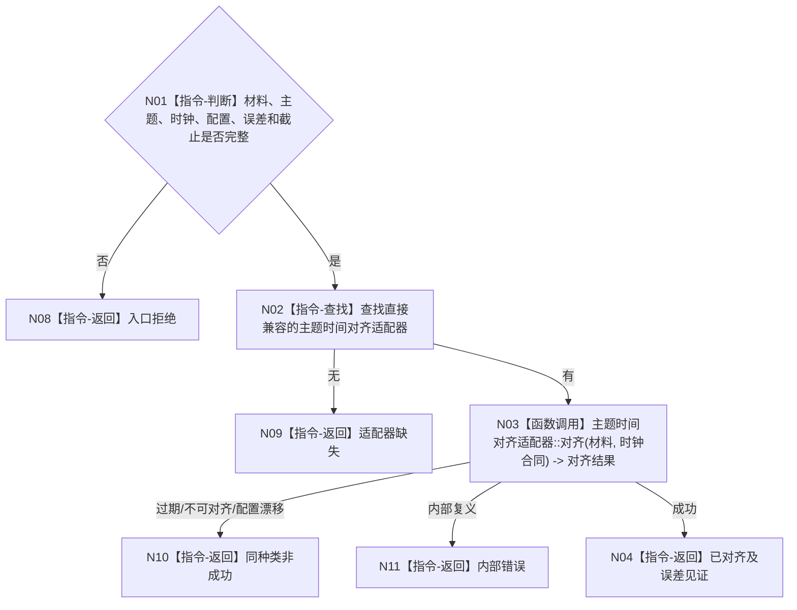

# BIZ-L3-006-03-02 执行外设主题时间对齐目标函数流程图 v0.1

更新时间：2026-08-03

## 依据

```text
6340、6350；BIZ-L2-006-03
```

## 身份与边界

正式目标函数设计图。按外设主题和时钟合同对齐材料时间；不得跨配置拼接或用当前系统时间覆盖来源时间。

## 函数合同

```text
根函数：外设主题处理路由::执行外设主题时间对齐
归属模块 / 文件 / 层级：外设主题处理路由 / 海中鱼巣/适配/路由.外设主题处理.ixx / L3
现有或待新增：待新增；具体相机同步算法作为主题适配器
完整签名：外设时间对齐结果 外设主题处理路由::执行外设主题时间对齐(const 外设时间对齐请求& 请求) const
参数：请求为只读借用；含原始材料视图、外设类型合同、时钟版本、配置版本、允许误差和截止时间
返回结果：值式结果；含已对齐、不可对齐、材料过期、配置漂移、适配器缺失或内部错误，以及对齐材料引用和误差见证
被调函数流程图：BIZ-L4-006-03-02-01 双目相机时间对齐适配器对齐；其它外设主题在正式登记后新增对应L4
父图：BIZ-L2-006-03
```

## 流程图



## 节点合同

| 节点 | 类型 | 参数 / 输入绑定 | 结果 / 输出绑定 | 事实读写 | 后继条件 | 验证 |
| --- | --- | --- | --- | --- | --- | --- |
| N02/N03 | 指令/函数调用 | 主题与材料 | 对齐结果 | 只形成派生材料 | 具名状态 | 漂移、跨配置、误差超限 |
| N04 | 返回 | 合法结果 | 对齐材料与见证 | 无业务写入 | 完成 | 来源时间可回查 |

## 关键边界

时间对齐只建立材料可比性，不生成变化、存在或因果结论。
