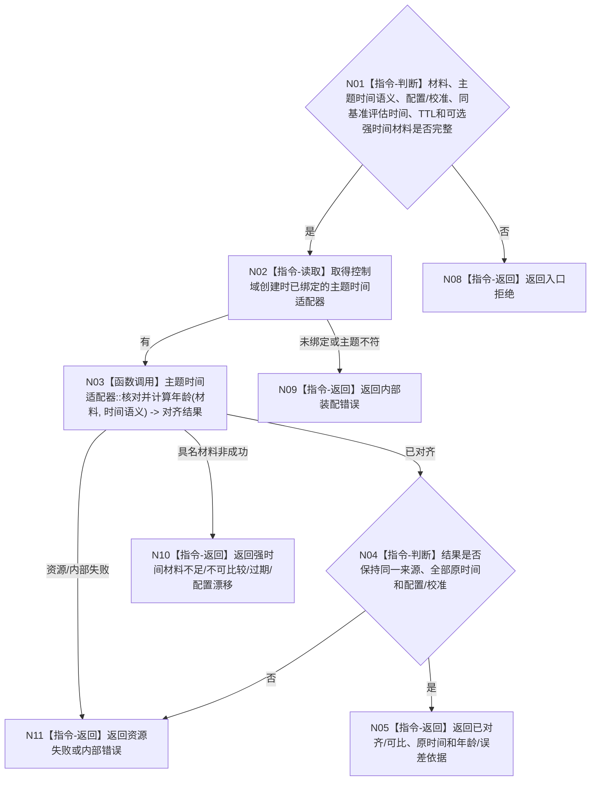

# BIZ-L3-006-03-02 执行外设主题时间对齐目标函数流程图 v0.2

更新时间：2026-08-27

## 依据

```text
6210、6340 v0.6、6350 v0.6；BIZ-L2-006-03 v0.2
HEAD 85aa5903：D455材料同时保留设备原时间和宿主接收单调时间；缓存已按宿主单调时间计算TTL
```

## 身份与边界

正式目标职责图。按主题已声明的时间语义保持来源时间，并在同一可证明时间基准内计算材料年龄/可比性。不得把宿主时间覆盖设备时间，也不得在无正式强时间合同时补造跨设备、跨进程或跨重启映射。

## 函数合同

```text
根目标：执行外设主题时间对齐
归属模块 / 文件 / 目标分解深度：控制域创建时绑定的主题时间适配边界 / 具体文件待详细设计 / BIZ-L3
现有或待新增：通用职责待新增；具体D455职责由BIZ-L4-006-03-02-01承担
候选签名：外设时间对齐结果 执行外设主题时间对齐(const 外设时间对齐请求& 请求) noexcept
参数最低职责：已核对原始材料、主题时间语义、设备原时间、宿主接收时间、同基准当前评估时间、TTL和配置/校准；只有目标确需跨基准比较时才附正式强时间映射
返回结果最低分类：已对齐/可比、材料过期、不可比较、强时间材料不足、配置漂移、入口拒绝、资源失败或内部错误；成功保持全部原时间并给出年龄/误差依据
被调函数流程图：BIZ-L4-006-03-02-01；其它主题在正式登记后新增对应BIZ-L4
父图：BIZ-L2-006-03 v0.2
```

## 流程图



## 节点合同

| 节点 | 类型 | 参数 / 输入绑定 | 结果 / 输出绑定 | 事实读写 | 后继条件 | 验证 |
| --- | --- | --- | --- | --- | --- | --- |
| N02/N03 | 查找/函数调用 | 主题、材料、版本化映射合同 | 对齐结果 | 只形成派生材料 | 具名状态 | 无映射、跨配置、过期、误差超限 |
| N04/N05 | 判断/返回 | 已对齐结果 | 原时间、年龄/误差依据与完整见证 | 无业务写入 | 全字段互证 | 来源时间保持且计算基准可回查 |

## 当前代码对照

HEAD已能用宿主接收单调时间和同基准当前时间计算运行期年龄，但没有跨设备/进程/重启的强时间合同。前者可以直接复用，后者不能从墙钟、设备时间或当前调用补造。

## 关键边界

时间对齐只建立材料的时间可比性，不形成四类主题产品，不生成空间变化、存在、状态或因果结论。
