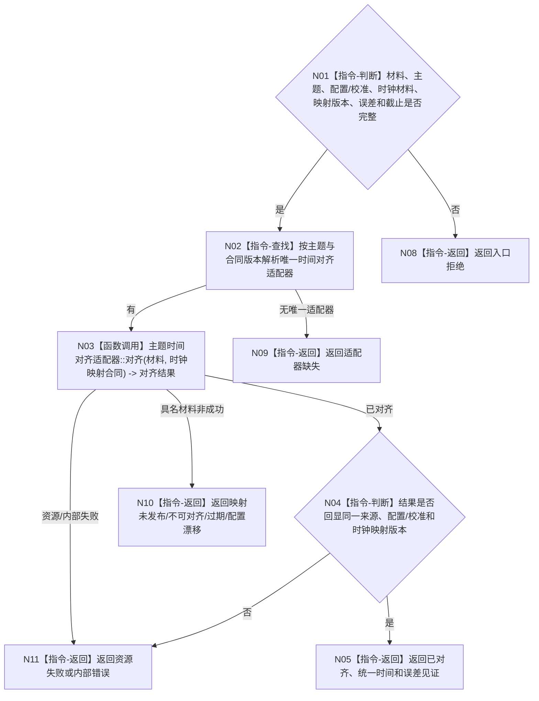

# BIZ-L3-006-03-02 执行外设主题时间对齐目标函数流程图 v0.2

更新时间：2026-08-27

## 依据

```text
6210、6340 v0.6、6350 v0.6；BIZ-L2-006-03 v0.2
HEAD 05b086e7：协议.D455采样材料.ixx、采集器.D455相机.ixx
```

## 身份与边界

正式目标函数设计图。按外设主题、配置/校准和版本化时钟映射合同把来源时间对齐到同一正式时间基准；不得跨配置拼接、用当前宿主时间覆盖设备时间，或把“同时由一次SDK调用返回”冒充正式跨时钟对齐。

## 函数合同

```text
根函数：外设主题处理路由::执行外设主题时间对齐
归属模块 / 文件 / 目标分解深度：外设主题处理路由 / 海中鱼巣/适配/路由.外设主题处理.ixx / BIZ-L3
现有或待新增：待新增；具体D455规则由BIZ-L4-006-03-02-01承担
完整签名：外设时间对齐结果 外设主题处理路由::执行外设主题时间对齐(const 外设时间对齐请求& 请求) const noexcept
参数：请求为只读借用；含已读原始材料、外设主题、配置/校准版本、设备与宿主时钟材料、期望时钟映射版本、允许误差和截止
返回结果：值式结果；含已对齐、不可对齐、材料过期、映射未发布、配置漂移、适配器缺失、资源失败或内部错误，以及对齐材料、统一时间、映射版本和误差见证
被调函数流程图：BIZ-L4-006-03-02-01；其它主题在正式登记后新增对应BIZ-L4
父图：BIZ-L2-006-03 v0.2
```

## 流程图



## 节点合同

| 节点 | 类型 | 参数 / 输入绑定 | 结果 / 输出绑定 | 事实读写 | 后继条件 | 验证 |
| --- | --- | --- | --- | --- | --- | --- |
| N02/N03 | 查找/函数调用 | 主题、材料、版本化映射合同 | 对齐结果 | 只形成派生材料 | 具名状态 | 无映射、跨配置、过期、误差超限 |
| N04/N05 | 判断/返回 | 已对齐结果 | 统一时间与完整见证 | 无业务写入 | 全字段互证 | 来源时间和映射版本可回查 |

## 当前代码对照

HEAD只保存D455设备时间与宿主采集时间材料；没有正式版本化设备—宿主时钟映射、跨时钟读回或本图目标适配器，因此不能宣称正式时间对齐已实现。

## 关键边界

时间对齐只建立材料的时间可比性，不形成四类主题产品，不生成空间变化、存在、状态或因果结论。
