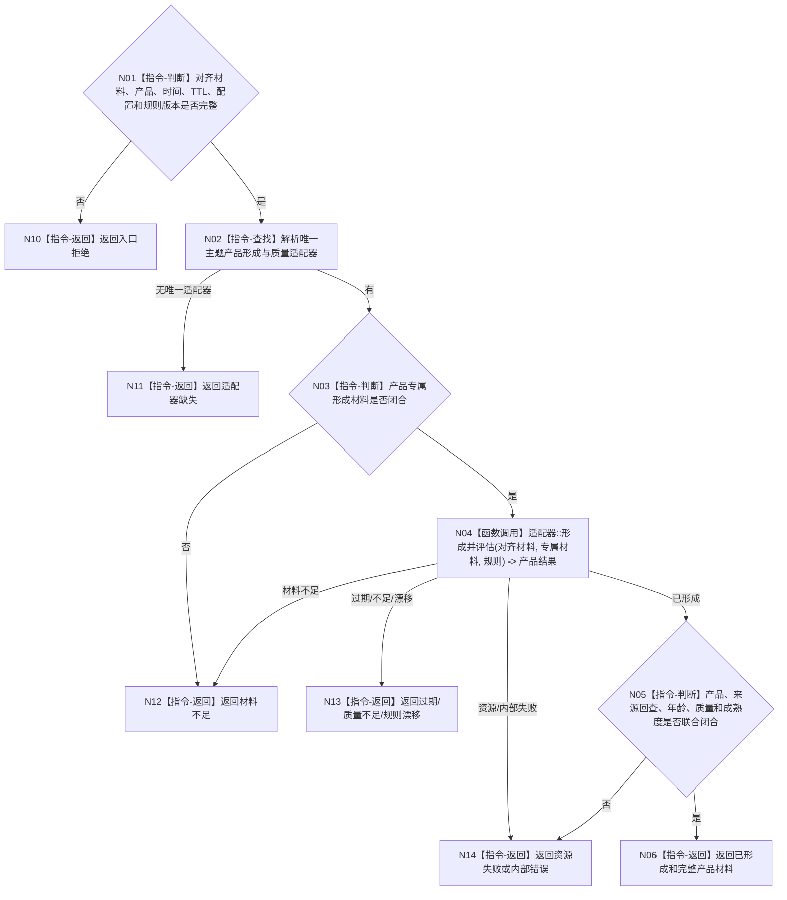

# BIZ-L3-006-03-03 形成外设主题产品并计算年龄与质量目标函数流程图 v0.2

更新时间：2026-08-27

## 依据

```text
6310、6340 v0.6、6350 v0.6；BIZ-L2-006-03 v0.2
HEAD 05b086e7：协议.D455采样材料.ixx、采集器.D455相机.ixx
```

## 身份与边界

正式目标函数设计图。先按主题合同从对齐材料形成具名产品，再计算年龄、局部质量和成熟度。四类产品形成不是给同步帧加枚举标签：原始逐簇需要分割和来源回查，稳定子集需要跨轮稳定材料，扫描变化需要基准与覆盖，目标跟踪需要目标种子与跟踪窗口。缺少产品专属材料时必须结构化返回材料不足。

## 函数合同

```text
根函数：外设主题处理路由::形成主题产品并计算年龄与质量
归属模块 / 文件 / 目标分解深度：外设主题处理路由 / 海中鱼巣/适配/路由.外设主题处理.ixx / BIZ-L3
现有或待新增：待新增；D455叶由BIZ-L4-006-03-03-01承担
完整签名：外设主题产品形成结果 外设主题处理路由::形成主题产品并计算年龄与质量(const 外设主题产品形成请求& 请求) const noexcept
参数：请求为只读借用；含对齐材料、产品类型、发生/评估时间、TTL、配置、产品形成/成熟度/质量规则版本，以及该产品所需的分割、跨轮稳定、扫描基准/覆盖或跟踪种子/窗口材料
返回结果：值式结果；含已形成、材料不足、质量不足、材料过期、规则漂移、适配器缺失、资源失败或内部错误，以及强类型主题产品、来源回查、年龄、全局/局部质量、成熟度和不可得原因组
被调函数流程图：BIZ-L4-006-03-03-01；其它主题在正式登记后新增对应BIZ-L4
父图：BIZ-L2-006-03 v0.2
```

## 流程图



## 产品专属材料矩阵

| 产品 | 最低形成材料 | 禁止的伪形成 |
| --- | --- | --- |
| 原始逐簇 | 空间/对象分割结果、每簇回到原始帧与配置的来源引用 | 把整帧当作一个默认簇 |
| 稳定子集 | 多轮同源候选、稳定窗口和成员对应见证 | 单帧质量高即称稳定 |
| 扫描变化 | 同范围正式基准、当前覆盖和差异材料 | 只有当前帧即声称变化 |
| 目标跟踪 | 目标种子、跟踪窗口、跨轮关联和丢失原因 | 无目标身份地逐帧生成新目标 |

## 当前代码对照

HEAD只能取得同步彩色、深度、左右红外、标定/配置和采集元数据；没有上述四产品的正式形成器、跨轮稳定、扫描基准或跟踪实现。本图当前全部属于待实现目标。

## 关键边界

质量和成熟度只描述已经形成的具名产品；不得用质量评估替代产品形成，也不得把产品形成解释为任务命中或世界事实成立。
