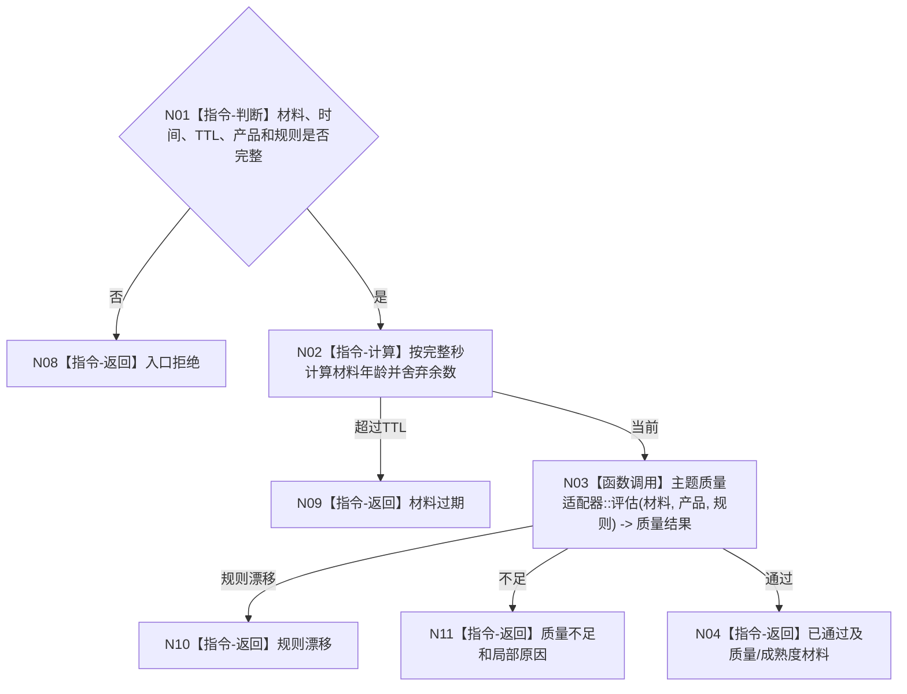

# BIZ-L3-006-03-03 计算外设材料年龄与质量目标函数流程图 v0.1

更新时间：2026-08-03

## 依据

```text
6340、6350；BIZ-L2-006-03
```

## 身份与边界

正式目标函数设计图。按主题质量规则计算材料年龄、局部质量和成熟度资格；整体质量不得覆盖局部不可得项。

## 函数合同

```text
根函数：外设主题处理路由::计算材料年龄与质量
归属模块 / 文件 / 层级：外设主题处理路由 / 海中鱼巣/适配/路由.外设主题处理.ixx / L3
现有或待新增：待新增；主题质量算法保持私有
完整签名：外设材料质量结果 外设主题处理路由::计算材料年龄与质量(const 外设材料质量请求& 请求) const
参数：请求为只读借用；含对齐材料、发生时间、评估时间、TTL、报告/产品类型、成熟度规则和质量规则版本
返回结果：值式结果；含已通过、质量不足、材料过期、规则漂移或内部错误，以及年龄、全局与局部质量、成熟度和不可得原因组
被调函数流程图：BIZ-L4-006-03-03-01 双目相机质量适配器评估；其它外设主题在正式登记后新增对应L4
父图：BIZ-L2-006-03
```

## 流程图



## 节点合同

| 节点 | 类型 | 参数 / 输入绑定 | 结果 / 输出绑定 | 事实读写 | 后继条件 | 验证 |
| --- | --- | --- | --- | --- | --- | --- |
| N02 | 指令 | 来源与评估时间 | 年龄 | 无写入 | 当前或过期 | 边界秒、负时间 |
| N03/N04 | 函数调用/返回 | 对齐材料和规则 | 质量材料 | 只形成材料 | 通过或具名不足 | 局部质量、成熟度二轴 |

## 关键边界

质量通过仍不等于任务命中或正式观察；L0—L3成熟度不得替代逻辑供给产品类型。
